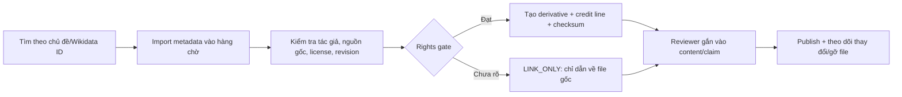
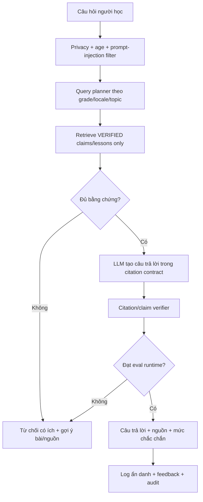
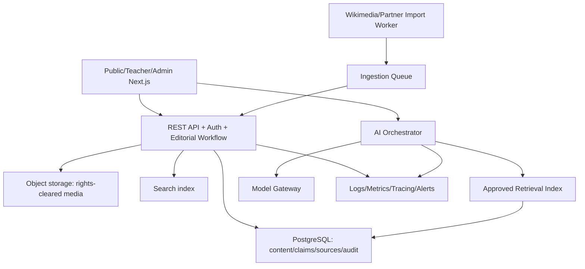

# Kế hoạch 12 tháng xây dựng Cổng Tri thức Lịch sử Việt Nam có AI đồng hành

> Phiên bản: 4.14 — **GLOBAL BUILD MASTER / kế hoạch hợp nhất, nguồn chuẩn duy nhất**
> Ngày cập nhật: 14/08/2026  
> Kế hoạch cơ sở đã hợp nhất: `KE_HOACH_WEBSITE_LICH_SU_QUAN_SU_VIET_NAM.md` (bản 16 tuần, 06/08/2026)  
> Phạm vi đánh giá: mã nguồn, 172 Flow card, test, API/OpenAPI, giao diện, release evidence và DoD artifacts trong workspace hiện tại
> Mục tiêu: đưa nền tảng **Quân Sử Việt** hiện có thành Public Beta năm 1 của một cổng tri thức lịch sử Việt Nam có nguồn, có kiểm duyệt, hữu ích cho học sinh, sinh viên, giáo viên và cộng đồng.  
> **Quy tắc global:** mọi build card mới, thay đổi scope, báo cáo tiến độ, release gate và quyết định ưu tiên bắt buộc đọc và cập nhật file này trước; file kế hoạch 16 tuần chỉ là tài liệu lịch sử.

### Trạng thái điều hành tại 14/08/2026

| Hạng mục | Trạng thái hiện tại | Bằng chứng chuẩn |
|---|---|---|
| Flow planning | PASS; contract đã khóa; **174 card đã tạo, 174 done, C-174 hiện tại** | `flow/00-idea.md`…`flow/05-contract.md`, `bash /Users/admin/.agents/skills/flow/runner/flow.sh status` |
| Public product surface | PASS trên local production-like evidence; các journey public đã có | `artifacts/operations/live-smoke-proof.json`, `artifacts/transparency/live-transparency-proof.json` |
| Curriculum 6–12 | PASS mandatory coverage trong scope hiện tại | `artifacts/curriculum-completeness/live-coverage.json` |
| Release quality | PASS_LOCAL_ONLY; source tree khớp với tested current-main revision `15b7583`; không phải official production | `artifacts/release/current-head-evidence.json` |
| AI machine evaluation | PASS 500/500; public AI vẫn DISABLED | `artifacts/ai-eval/report-500.json`, `artifacts/privacy/report.json` |
| Model-comparison handoff | BLOCKED_EXTERNAL fail-closed; example thiếu model/metrics/owner; same deterministic gateway comparison không được coi là independent evidence | `cards/C-155.md`, `scripts/model-comparison-check.mjs`, `artifacts/ai-eval/model-comparison-readiness.json`, `docs/operations/model-comparison-protocol.md` |
| DPIA/privacy handoff | BLOCKED_EXTERNAL fail-closed; canonical policy và 8 control markers được kiểm tra, nhưng approval/owner pháp lý thật chưa có | `cards/C-156.md`, `scripts/dpia-readiness-check.mjs`, `artifacts/privacy/dpia-readiness.json`, `docs/operations/dpia-handoff-protocol.md` |
| Independent-security handoff | BLOCKED_EXTERNAL fail-closed; local static pack không được coi là pen-test, report/reviewer/scope thật chưa có | `cards/C-157.md`, `scripts/security-handoff-check.mjs`, `artifacts/security/security-handoff-readiness.json`, `docs/operations/security-handoff-protocol.md` |
| Wikimedia/partner rights handoff | BLOCKED_EXTERNAL fail-closed; batch/ledger hash-bound, 300 rows link-only, 0 binary approval, 2 partner permission records thật chưa có | `cards/C-158.md`, `scripts/rights-handoff-check.mjs`, `artifacts/wikimedia/rights-handoff-readiness.json`, `docs/operations/rights-handoff-protocol.md` |
| Wikimedia | PASS metadata pilot **300/300 record có identity/revision/description**, 1 candidate malformed đã bị skip; binary serving tắt; rights review chưa xong | `artifacts/wikimedia/batch-300-report.json`, `artifacts/wikimedia/rights-review-ledger.json` |
| Published editorial history | BLOCKED_INTERNAL; 105/105 hàng cần người duyệt thật; packet bàn giao đọc-only đã tạo, không tự xác nhận | `artifacts/curriculum-completeness/published-content-audit.json`, `artifacts/curriculum-completeness/published-content-history-plan.json`, `artifacts/curriculum-completeness/published-content-review-packet.json` |
| Published-history packet validator | PASS_PACKET_PENDING_HUMAN; packet 105 hàng hợp lệ, hash khớp, 105 pending/0 reviewed, 0 DB writes, Public Beta false | `cards/C-159.md`, `scripts/published-history-packet-check.mjs`, `artifacts/curriculum-completeness/published-history-packet-readiness.json`, `docs/operations/published-history-review-protocol.md` |
| Global Master consistency | PASS_GLOBAL_MASTER_CONSISTENT; kế hoạch hợp nhất khớp Flow snapshot 174/174, vị trí M11/M12, packet lịch sử và 11 external blockers; chỉ đọc | `cards/C-160.md`, `cards/C-173.md`, `cards/C-174.md`, `scripts/global-master-consistency-check.mjs`, `artifacts/release/global-master-consistency.json`, `docs/operations/global-master-consistency-protocol.md` |
| Production config preflight | BLOCKED_EXTERNAL theo đúng thiết kế khi không có env production thật; kiểm tra HTTPS/DB path/secret/demo seed chỉ đọc, không bật release | `cards/C-161.md`, `scripts/production-config-preflight.mjs`, `artifacts/operations/production-config-preflight.json`, `docs/operations/production-config-preflight.md` |
| Merged-main release evidence | PASS_LOCAL_ONLY; release/readiness/DoD artifacts được tái tạo trên current main revision `15b7583`; không phải official production | `cards/C-162.md`, `cards/C-173.md`, `cards/C-174.md`, `artifacts/release/current-head-evidence.json`, `artifacts/release/dod-audit.json`, `artifacts/transparency/dashboard.json` |
| Immutable container image | PASS_SUPPLY_CHAIN_ONLY; GHCR image publish job chạy trên merge commit `7f2b24c`, digest `sha256:7a67ee8f448f3d399fb1c846dd2c4e6a79f38c53e10fc1ebb83e21ecdd7cec13` đã lưu; chưa deploy production, Public Beta false | `cards/C-163.md`, `cards/C-166.md`, `cards/C-167.md`, `cards/C-173.md`, `.github/workflows/container-publish.yml`, `docs/release-runbook.md` |
| GHCR runtime smoke | PASS_LOCAL_CONTAINER_ONLY; image theo digest chạy được, health/OpenAPI/search `200`, Docker health `healthy`; không phải official production | `cards/C-167.md`, `cards/C-173.md`, `artifacts/operations/ghcr-runtime-smoke.json`, `artifacts/operations/ghcr-runtime-smoke.md` |
| Scheduled production uptime monitor | PASS_WORKFLOW_CONTRACT_ONLY; GitHub Actions chạy theo lịch/manual, đọc secret `PRODUCTION_ORIGIN`, từ chối local/tunnel/example origin và upload report 90 ngày; chưa có origin production/90-day evidence | `cards/C-174.md`, `.github/workflows/production-uptime.yml`, `docs/operations/uptime-monitor.md`, `tests/operations/production-uptime-workflow.test.ts` |
| Public correction intake + moderation | PASS_LOCAL_ONLY; bilingual form/API, non-PII receipt/SLA, authenticated queue, role/version checks và audited transitions đã có; Council/public content vẫn không tự động thay đổi | `cards/C-137.md`, `cards/C-142.md`, `src/app/[locale]/corrections/page.tsx`, `src/app/api/v1/corrections/route.ts`, `src/app/api/v1/admin/corrections/route.ts` |
| External evidence intake | PASS_INTAKE_SCHEMA; validator read-only nhận pending ledger và fail-closed với PASS thiếu owner/authority/timestamp/artifact hash; không phải approval | `cards/C-144.md`, `scripts/external-evidence-intake.mjs`, `artifacts/operations/external-evidence-intake.json` |
| Docker release smoke | PASS_LOCAL_ONLY; image build được với build context tối thiểu, migration/seed/health/OpenAPI/search và persistence sau restart đã kiểm chứng; không phải official production | `cards/C-146.md`, `artifacts/release/container-smoke-proof.json`, `docs/release-runbook.md` |
| Regression/CI smoke | PASS_LOCAL_ONLY; bare `npm test` chạy 72 files/260 tests sau khi timeout standalone được đặt rõ 30s; không thay thế live production evidence | `cards/C-147.md`, `tests/operations/local-standalone-smoke.test.ts` |
| CI fixture | PASS_LOCAL_ONLY; clean checkout được migrate + seed demo trước test; workflow không chứa production secret và không phải production evidence | `cards/C-148.md`, `.github/workflows/ci.yml` |
| Reviewer handoff packet | PASS_LOCAL_ONLY; 105 hàng, 210 translation rows (209 published), source/claim gaps được phơi bày; zero DB writes, reviewer/signature để trống | `cards/C-149.md`, `scripts/published-content-review-packet.mjs`, `artifacts/curriculum-completeness/published-content-review-packet.json` |
| Reviewer queue evidence states | PASS_LOCAL_ONLY; queue/API/OpenAPI hiển thị readiness source/claim và trạng thái VI/EN, chỉ đọc | `cards/C-150.md`, `src/lib/content/editorial.ts`, `src/components/admin/PublishedHistoryQueue.tsx`, `src/lib/openapi/editorial-catalog.ts` |
| AI golden-set review ledger | PASS_LOCAL_ONLY; 500 hàng machine-eval có schema reviewer role/authority/evidence, validator fail-closed; human approval vẫn pending | `cards/C-152.md`, `scripts/ai-human-review-ledger.mjs`, `artifacts/ai-eval/human-review-ledger.json`, `docs/operations/ai-human-review-protocol.md` |
| Production handoff validator | BLOCKED_EXTERNAL by design; manifest checks HTTPS target, digest, six routes, rollback/monitoring, RPO/RTO and named owners without accepting secrets; no deployment target supplied | `cards/C-153.md`, `scripts/production-handoff-check.mjs`, `artifacts/operations/production-handoff-check.json`, `docs/operations/production-handoff.md` |
| DoD năm 1 | NOT_READY; Public Beta false; matrix consistent | `artifacts/release/dod-audit.json`, `artifacts/release/dod-matrix-consistency.json` |

**Kết luận giai đoạn:** dự án đã hoàn tất nền móng kỹ thuật, MVP public scope, curriculum 6–12, workflow nội dung, AI safety prototype, metadata Wikimedia và local release verification. Dự án **chưa đạt Gate M12/Public Beta** vì còn 105 attestation lịch sử biên tập và 11 external gates. Không dùng các nhãn “production”, “đã được Hội đồng duyệt” hoặc “Public Beta” cho đến khi có evidence tương ứng.

**Vị trí tiến độ 12 tháng tại snapshot này:** đang ở cuối **Tháng 11 / Gate M11 — hardening và release candidate**, với bằng chứng local production-like đã PASS trên tested current-main revision `15b7583`, immutable GHCR image đã publish và runtime smoke theo digest đã pass, nhưng chưa phải official production. C-144 bổ sung cổng kiểm tra packet external evidence, C-145 đồng bộ provenance sau commit, C-146 kiểm chứng Docker volume/restart, C-147 làm CI regression timeout rõ ràng, C-148 làm clean CI checkout có fixture dữ liệu tái lập, C-149 tạo packet bàn giao reviewer đọc-only cho 105 hàng lịch sử, C-150 đưa trạng thái evidence vào hàng đợi reviewer trên website, C-151 đồng bộ bộ đếm Global Master, C-152 khóa schema reviewer độc lập cho AI golden set, C-153 tạo validator bàn giao production fail-closed, C-154 sửa batch Wikimedia để loại record `wikimedia-undefined`/backfill candidate hợp lệ, C-155 tạo validator handoff cho model comparison, C-156 tạo validator hash-bound cho DPIA/privacy, C-157 tạo validator handoff cho independent security, C-158 tạo validator hash-bound cho Wikimedia/partner rights, C-159 kiểm tra packet bàn giao 105 hàng lịch sử, C-160 kiểm tra nhất quán bản kế hoạch Global Master, C-161 khóa preflight cấu hình production fail-closed, C-162 tái bind release evidence sau PR #21, C-163 publish immutable image, C-164 ghi nhận digest, C-165 ghi nhận runtime smoke của image immutable, C-166 tái bind release/runtime/handoff evidence sau merge, C-167 tái bind release/runtime/handoff evidence sau PR #26 và xác nhận lại merge-only provenance trên `main`, C-168 vá dependency `nanoid` high-severity và tái tạo security/release evidence, C-169 bổ sung internal evidence hash-bound cho packet bàn giao external, C-170 tái bind release/runtime/handoff evidence vào merge commit hiện tại, C-171 xác nhận release evidence trên đúng merge SHA của `main`, C-172 cập nhật runtime smoke cho immutable image của merge hiện tại, C-173 ghi nhận digest mới của current main và smoke runtime disposable-container với fail-closed flags, C-174 thêm scheduled production uptime monitor fail-closed theo secret và retention artifact. Các bước này chỉ làm nền tảng đáng tin cậy hơn, không tự biến pending thành approval. Vì vậy tiến độ kỹ thuật của Flow là **174/174 card đang hoàn tất trong phiên này**, còn tiến độ ra mắt công khai vẫn **M12 NOT_READY / Public Beta false**.

### Bản hợp nhất đang có hiệu lực

Hai tài liệu kế hoạch đã được gộp theo nguyên tắc một nguồn chuẩn:

| Tài liệu | Vai trò từ nay | Cách sử dụng |
|---|---|---|
| `KE_HOACH_12_THANG_CONG_TRI_THUC_LICH_SU_VIET_NAM_AI.md` | **Global Master v4.14** | Nguồn duy nhất cho scope, roadmap, gate, KPI, DoD, blocker và mọi card mới |
| `KE_HOACH_WEBSITE_LICH_SU_QUAN_SU_VIET_NAM.md` | Tài liệu cơ sở/lịch sử 16 tuần | Chỉ dùng để tra cứu yêu cầu MVP cũ; mọi thay đổi phải cập nhật ngược vào Global Master |

Crosswalk ở Mục 11.0 giữ lại toàn bộ mã giai đoạn A–J và FR01–FR14 của bản 16 tuần, nên không mất yêu cầu cũ; các yêu cầu đó đã được đặt vào tháng, gate và Definition of Done tương ứng của kế hoạch 12 tháng.

### Bảng tiến độ điều hành hiện tại

| Chỉ số | Kết quả hiện tại | Diễn giải |
|---|---:|---|
| Tiến độ Flow | **174/174 card sau khi C-174 được kiểm tra (100%)** | Nền tảng kỹ thuật, metadata/rights gate, AI/privacy/security handoff, packet lịch sử, Global Master, production preflight, merged-main release evidence, immutable image handoff, current digest runtime smoke, scheduled uptime monitor contract, dependency security patch, external handoff internal evidence và exact-merge provenance đã hoàn tất |
| Vị trí roadmap | **Cuối M11 / chuẩn bị M12** | Đang ở release-candidate hardening, chưa mở Public Beta |
| Release quality | **4/4 PASS_LOCAL_ONLY** | Tested current main revision `15b7583`; local standalone, không phải domain production |
| Curriculum mandatory | **PASS trong scope đã ký** | Không đồng nghĩa 105 hàng lịch sử đã có attestation người thật |
| AI golden set | **500/500 machine-eval; 0/500 dual human approval** | AI công khai vẫn tắt |
| Wikimedia | **300/300 metadata record hợp lệ; binary serving tắt** | 1 candidate thiếu metadata bị skip; rights review/permission archive còn thiếu |
| DoD năm 1 | **NOT_READY** | Ma trận nhất quán; Public Beta `false` |
| External blockers | **11** | Cần owner/người duyệt/đơn vị thật cung cấp bằng chứng |

**Quy tắc chuyển M11 → M12:** chỉ chuyển khi production handoff manifest có target HTTPS thật, release/image/deploy evidence được owner xác nhận, independent security, Council, rights, DPIA, pilot và named operations đã được ghi nhận. Không có dữ liệu đó thì tiếp tục giữ `NOT_READY`, dù toàn bộ test nội bộ đều xanh.

---

## 1. Tuyên bố định hướng

Sản phẩm không nên là một website “chép lại Wikipedia”, một thư viện link, hay một chatbot nói trôi chảy nhưng không chịu trách nhiệm về sự thật. Sản phẩm phải là một **hệ thống tri thức có quản trị**: mỗi bài học, luận điểm, hình ảnh, bản đồ và câu trả lời AI đều dẫn về nguồn; nội dung nhạy cảm được người có chuyên môn duyệt; quyền tái sử dụng tư liệu được kiểm tra; phần chưa chắc chắn được nói rõ.

Triết lý sản phẩm:

> **Dân ta phải biết sử ta — biết bằng nguồn, hiểu bằng bối cảnh, nhớ bằng trải nghiệm, và có khả năng tự kiểm chứng.**

Tầm nhìn dài hạn là “cái nôi tri thức lịch sử Việt Nam”. Tuy nhiên, trong 12 tháng không được tuyên bố đã bao quát “toàn bộ lịch sử Việt Nam”. Đích đến thực tế là **Public Beta quốc gia có nền móng mở rộng lâu dài**, bao gồm:

- Lộ trình học Lịch sử lớp 6–12 được đối chiếu với chương trình chính thức.
- Một kho bài học và hồ sơ chuyên đề được biên soạn gốc, có nguồn và có người duyệt.
- Kho tư liệu liên kết Wikimedia Commons, Wikidata, bảo tàng, thư viện và lưu trữ theo đúng quyền sử dụng.
- Trợ giảng AI chỉ trả lời từ phần tri thức đã duyệt, luôn trích dẫn và biết từ chối khi thiếu chứng cứ.
- Timeline, bản đồ, mạng quan hệ, bài học, nguồn và AI dùng chung một mô hình dữ liệu.
- Hệ thống vận hành có staging, giám sát, sao lưu, phục hồi, bảo mật, khả năng tiếp cận và quy trình đính chính công khai.

---

## 2. Kết luận điều hành

### 2.1. Dự án hiện có gì

Dự án hiện tại **không bắt đầu từ số 0**. Nó đã hoàn thành một nền móng kỹ thuật và thiết kế đáng kể:

| Nhóm | Hiện trạng đã kiểm chứng |
|---|---|
| Runtime | Next.js 16, TypeScript, một deployable unit, Docker/standalone |
| Dữ liệu | SQLite có migration, WAL/persistent-volume strategy, seed lặp lại an toàn |
| Nội dung | 50 content node demo, 100 bản dịch Việt–Anh, sự kiện/nhân vật/hiện vật/chủ đề/thời kỳ |
| Public API | REST `/api/v1`, OpenAPI runtime, tìm kiếm không dấu, collection, timeline, source, curriculum |
| Quản trị | Đăng nhập, Argon2id, session, RBAC Admin/Editor/Reviewer, workflow duyệt–xuất bản |
| Kiểm chứng | Source governance, claim/evidence, reviewer, audit log, provenance và rights status |
| Học tập | Danh mục “Học theo lớp”, ma trận requirement lớp 6–12, trang bài học có mục tiêu/phân tích/tranh luận/nguồn |
| Giao diện | Hệ nhận diện riêng, responsive, song ngữ, timeline, collection, source catalog, loading/motion |
| Chất lượng | Lint/typecheck/build/release evidence đạt trên current-head; focused và regression tests có bằng chứng trong các card gần nhất |
| Release | Có runbook, health check, backup/restore, dependency audit, accessibility/performance evidence |

Flow hiện có **174 thẻ**: C-001 đến C-174; **174 thẻ done** và C-174 là card hiện tại cho scheduled production uptime monitor contract. Các card C-028–C-038 đã được thực thi và bằng chứng của chúng nằm trong `artifacts/`/lịch sử git; không dùng số liệu 38-card cũ để báo cáo hiện trạng.

Kiểm tra ngày 11/08/2026 cũng phát hiện hai điều phải xử lý trước khi mở rộng:

1. Bằng chứng release gần nhất trong `artifacts/release` từng thuộc commit cũ hơn HEAD tại thời điểm kiểm tra; **đã xử lý qua C-166** bằng cách tái tạo evidence cho HEAD `908ac3e`. Evidence này vẫn chỉ là local production-like, không phải official production.
2. Dev server đang mở trên máy hiển thị trang lỗi “Không thể tải kho tư liệu” do không đọc được public data. Test vẫn xanh, nên đây là khoảng trống cấu hình/vận hành, minh họa vì sao cần staging ổn định và live smoke test tự động.

### 2.2. Dự án còn thiếu gì để đạt tầm nhìn mới

| Mức | Khoảng trống | Vì sao quan trọng |
|---|---|---|
| P0 | Hội đồng sử học, quy chế biên tập và chính sách nội dung nhạy cảm | Công nghệ không thể tự trao thẩm quyền học thuật cho dự án |
| P0 | Hoàn tất corpus lớp 6–12 và gate C-038 | Hiện mới có cấu trúc và demo; chưa có bằng chứng phủ đủ chương trình |
| P0 | Staging cố định, release hiện hành, monitoring và cảnh báo | Phiên dev hiện lỗi dù test xanh; ảnh cũ không thay thế live proof |
| P0 | Chính sách quyền tác giả và hồ sơ cấp phép đối tác | Có URL không có nghĩa là được sao chép ảnh/tài liệu |
| P1 | Wikimedia ingestion có metadata, revision, license, credit và review queue | Wikimedia là nguồn khám phá/tư liệu lớn nhưng không được auto-publish |
| P1 | Trợ giảng AI/RAG có citation, abstention và eval | Kiến trúc hiện tại chủ động chưa làm AI |
| P1 | Công cụ giáo viên: lộ trình bài, câu hỏi, phiếu học, trình chiếu/lớp học | Website hiện thiên về tra cứu cá nhân |
| P1 | Track sinh viên/đại học và hồ sơ chuyên đề sâu | Lớp 6–12 chưa đáp ứng nhu cầu nghiên cứu cơ sở |
| P1 | Chính sách riêng tư và an toàn trẻ em cho AI | Đối tượng có người chưa thành niên; không được thu thập dữ liệu tùy tiện |
| P1 | Kênh báo lỗi/đính chính có chống spam và SLA | Cổng tri thức cộng đồng cần sửa sai công khai nhưng có kiểm soát |
| P1 | Analytics tôn trọng riêng tư và nghiên cứu người dùng định kỳ | Không thể đo giá trị chỉ bằng số trang đã xây |
| P2 | Knowledge graph và bản đồ dùng chung dữ liệu | Giúp thấy quan hệ thời gian–không gian–nhân vật–văn kiện |
| P2 | PWA/offline pack và chế độ băng thông thấp | Tăng khả năng tiếp cận ở trường học/khu vực mạng yếu |
| P2 | 3D/immersive có nguồn | Có giá trị trình diễn nhưng không được chặn mục tiêu nội dung và AI |

### 2.3. Quyết định phạm vi

**GO**, với điều kiện đổi cách gọi thành “Cổng Tri thức Lịch sử Việt Nam — Public Beta” và giữ **Quân Sử Việt** là một collection/chuyên mục mạnh trong hệ sinh thái, thay vì cố đổi toàn bộ thương hiệu ngay.

Không GO nếu dự án vẫn chỉ có một người làm mọi vai trò. Một cá nhân có thể xây nền móng kỹ thuật và prototype, nhưng không thể tự thay thế Hội đồng, reviewer, rights owner, pilot owner, DPIA approver và independent security reviewer. Kế hoạch này giả định có đội liên ngành tối thiểu ở Mục 15.

---

## 3. Nguyên tắc bất biến

1. **Nguồn trước, lời kể sau.** Mỗi claim công khai phải có evidence locator và nguồn được duyệt.
2. **Không nguồn, không trả lời chắc chắn.** AI phải từ chối hoặc diễn đạt mức bất định.
3. **AI không xuất bản.** AI chỉ soạn nháp/gợi ý; Reviewer con người mới có quyền duyệt.
4. **Không đánh đồng chính thống với mơ hồ.** Nội dung phải bám chương trình và nguồn có thẩm quyền, đồng thời tách rõ văn kiện gốc, sự kiện, diễn giải, tranh luận sử học và mốc cập nhật.
5. **Không tự nhận quyền tư liệu.** URL, thumbnail hoặc việc tư liệu xuất hiện trên mạng không phải giấy phép tái sử dụng.
6. **Không hứa “đầy đủ” khi coverage chưa đạt 100%.** Mọi dashboard và nhãn công khai phải trung thực.
7. **Không dùng 3D để che corpus rỗng.** Nội dung, nguồn, tìm kiếm, accessibility và AI grounded ưu tiên trước hiệu ứng.
8. **Một dữ liệu, nhiều cách học.** Timeline, bản đồ, bài học, quiz và AI phải dùng cùng content/claim/source graph.
9. **An toàn theo lứa tuổi.** Không coi giao diện cho sinh viên là phù hợp với học sinh nhỏ tuổi.
10. **Done là bằng chứng ngoài đời.** Mỗi mốc phải có URL staging/production, test, dữ liệu đo và người chịu trách nhiệm ký duyệt.

---

## 4. Định vị sản phẩm và cấu trúc thương hiệu

### 4.1. Kiến trúc thương hiệu đề xuất

Trong tháng 1, kiểm thử hai phương án với người dùng:

- Phương án A: giữ **Quân Sử Việt** làm thương hiệu chính, mở thêm các tuyến lịch sử chính trị, Đảng, văn hóa, xã hội.
- Phương án B: dùng thương hiệu ô **Dòng Sử Việt** hoặc **Sử Việt**, trong đó **Quân Sử Việt** là collection đầu tiên và có uy tín nhất.

Khuyến nghị tạm thời: dùng phương án B ở cấp kiến trúc thông tin, nhưng **không đổi logo/domain trước khi có user test và kiểm tra pháp lý nhãn hiệu**.

```text
Cổng Tri thức Lịch sử Việt Nam
├── Học theo lớp 6–12
├── Lịch sử Đảng và cách mạng Việt Nam
├── Lịch sử chính trị và nhà nước
├── Quân Sử Việt
├── Văn hóa, xã hội và đời sống
├── Nhân vật, địa danh và hiện vật
├── Kho tư liệu
├── Bản đồ và dòng thời gian
└── Trợ giảng AI
```

### 4.2. Lời hứa cho từng nhóm người dùng

| Nhóm | Lời hứa | Hành trình chính |
|---|---|---|
| Học sinh 6–9 | Hiểu mốc, nhân vật, nguyên nhân–kết quả bằng ngôn ngữ vừa sức | Chọn lớp → bài → timeline/bản đồ → nguồn → quiz |
| Học sinh 10–12 | Ôn theo chủ đề, phân biệt sự kiện–nhận định–bằng chứng | Chọn chủ đề → đọc sâu → so sánh nguồn → tự kiểm tra |
| Sinh viên | Có hồ sơ chuyên đề, văn kiện gốc, bibliography và citation export | Tìm chủ đề → knowledge graph → primary sources → ghi chú |
| Giáo viên | Có lesson pack, câu hỏi gợi mở và tài liệu trình chiếu có nguồn | Chọn lớp/chủ đề → tạo lesson pack → trình chiếu/tải PDF |
| Người nghiên cứu | Theo provenance, revision, locator và lịch sử đính chính | Claim → evidence → bản gốc/cơ quan lưu giữ → citation |
| Công chúng | Khám phá lịch sử đẹp, dễ dùng, không khô khan | Trang chủ → câu chuyện → timeline/map → nguồn |
| Biên tập viên | Nhập nguồn, soạn bài, kiểm tra quyền, gửi duyệt | Discovery → source record → claim → translation → review |
| Hội đồng duyệt | Kiểm tra học thuật, chính sách, bản quyền và công bố | Review queue → diff → evidence → approve/reject/publish |

### 4.3. Không phục vụ trực tiếp trong năm 1

- Không mở free-form AI chat cho trẻ mầm non/tiểu học.
- Không public signup, mạng xã hội, bình luận tự do hoặc nhắn tin.
- Không cho cộng đồng sửa bài trực tiếp kiểu wiki.
- Không tự động crawl toàn web.
- Không tự động dịch rồi xuất bản.
- Không làm nhiều scene 3D trước khi một scene chứng minh được giá trị học tập.
- Không tuyên bố là nguồn thay thế giáo trình, giảng viên, bảo tàng hoặc lưu trữ gốc.

---

## 5. Mô hình quản trị học thuật và “không lệch lạc”

“Không lệch lạc” không thể được thực hiện bằng một prompt chung. Nó cần cơ chế trách nhiệm rõ ràng.

### 5.1. Hội đồng và vai trò

- **Chủ nhiệm nội dung:** chịu trách nhiệm cuối cùng về chuẩn biên tập.
- **Cố vấn sử học Việt Nam:** tối thiểu 3 người, phủ cổ–trung đại, cận–hiện đại, lịch sử Đảng/chính trị.
- **Chuyên gia chương trình:** đối chiếu chương trình Bộ GDĐT và năng lực theo lớp.
- **Chuyên gia bảo tàng/lưu trữ:** kiểm tra provenance, mô tả hiện vật và quyền khai thác.
- **Chuyên gia ngôn ngữ:** bảo đảm thuật ngữ Việt–Anh không làm sai nghĩa.
- **Legal/IP reviewer:** duyệt mẫu giấy phép, thỏa thuận đối tác và trường hợp quyền không rõ.
- **AI safety reviewer:** sở hữu bộ eval, red-team và chính sách từ chối.

### 5.2. Bốn lớp nội dung

Mỗi bài phải tách được:

1. **Sự kiện/dữ kiện:** ai, khi nào, ở đâu, diễn biến gì; có date precision.
2. **Nguồn sơ cấp:** văn kiện, ảnh, hiện vật, hồ sơ lưu trữ, hồi ký; nói rõ tác giả/cơ quan/bối cảnh.
3. **Diễn giải đã được chấp nhận:** giải thích theo chương trình chính thức và công trình có thẩm quyền.
4. **Vấn đề còn tranh luận:** các cách giải thích khác nhau, mức đồng thuận và lý do không kết luận tuyệt đối.

Không dùng cụm “các nhà sử học đều cho rằng” nếu không có khảo cứu thật. Không biến một bài báo, một trang Wikipedia hoặc một nguồn nước ngoài thành căn cứ duy nhất cho claim quan trọng.

### 5.3. Quy trình duyệt nội dung nhạy cảm

Các chủ đề lịch sử Đảng, chiến tranh, chủ quyền, biên giới, nhân vật chính trị, quan hệ quốc tế và vấn đề có tranh luận cần **dual review**:

- Reviewer 1: kiểm chứng lịch sử và locator.
- Reviewer 2: đối chiếu chương trình/chính sách xuất bản và ngôn ngữ.
- Nếu có bất đồng: chuyển Hội đồng, không để AI tự hòa giải.
- Mọi sửa đổi sau xuất bản phải có lý do, diff, người duyệt và changelog công khai phù hợp.

Nguồn nền cho lịch sử Đảng/chính trị phải ưu tiên [Tư liệu Văn kiện Đảng](https://tulieuvankien.dangcongsan.vn/tu-lieu-van-kien-dang/lich-su-dang), văn bản nhà nước, ấn phẩm học thuật của cơ quan có thẩm quyền và bản gốc lưu trữ. Nội dung học theo lớp phải bám [Chương trình môn Lịch sử của Bộ GDĐT](https://moet.gov.vn/content/vanban/Lists/VBPQ/Attachments/1483/vbhn-chuong-trinh-mon-lich-su.pdf).

---

## 6. Chiến lược nguồn tư liệu và Wikimedia

### 6.1. Thứ tự ưu tiên nguồn

| Tier | Loại nguồn | Cách dùng |
|---|---|---|
| T1 | Văn kiện gốc, văn bản nhà nước, hồ sơ lưu trữ, dữ liệu cơ quan Đảng/Nhà nước | Làm căn cứ claim khi phù hợp; lưu locator/phiên bản |
| T2 | Bảo tàng, thư viện quốc gia, viện nghiên cứu, tạp chí/sách chuyên khảo phản biện | Nguồn giải thích và catalog hiện vật |
| T3 | UNESCO, thư viện/bảo tàng quốc tế, công trình học thuật có uy tín | Đối chiếu và bổ sung góc nhìn/bộ sưu tập |
| T4 | Wikimedia Commons/Wikidata/Wikipedia | Discovery, identifier, media có license, liên kết; không là căn cứ duy nhất cho claim nhạy cảm |
| T5 | Báo chí phổ thông, blog, mạng xã hội | Chỉ phát hiện câu hỏi người dùng hoặc đầu mối; không auto-publish |

Các kho ưu tiên hợp tác năm 1:

- Bảo tàng Lịch sử Quốc gia và Bảo tàng Lịch sử Quân sự Việt Nam.
- Cục Văn thư và Lưu trữ nhà nước, các Trung tâm Lưu trữ quốc gia.
- Thư viện Quốc gia Việt Nam.
- Tư liệu Văn kiện Đảng và Nhà xuất bản Chính trị quốc gia Sự thật.
- Các khoa Lịch sử, Lý luận chính trị và Việt Nam học ở đại học.
- Wikimedia Commons/Wikidata cho media/identifier mở.

### 6.2. Tại sao không “lấy lại toàn bộ” từ các website khác

- Website công khai không đồng nghĩa nội dung thuộc public domain.
- Bản chụp một hiện vật cổ vẫn có thể có quyền liên quan đến ảnh, catalog hoặc thỏa thuận của cơ quan lưu giữ.
- Nguồn có thể đổi URL, sửa metadata hoặc gỡ file.
- Một nguồn đúng cho discovery chưa chắc đủ độ tin cậy để làm claim lịch sử.
- Tái sử dụng không đúng attribution/license sẽ làm mất uy tín và tạo rủi ro pháp lý.

Wikimedia Commons cho phép tái sử dụng phần lớn media theo license riêng của từng file, nhưng chính Wikimedia yêu cầu người dùng tự kiểm tra tình trạng quyền, attribution, link license và điều kiện ShareAlike; Wikimedia không bảo đảm tuyệt đối metadata quyền là chính xác. Xem [hướng dẫn tái sử dụng chính thức](https://commons.wikimedia.org/wiki/Commons%3AReusing_content_outside_Wikimedia/en).

### 6.3. Pipeline Wikimedia đề xuất



Connector phải dùng MediaWiki API phía server. `imageinfo&iiprop=extmetadata` có thể trả metadata mở rộng như tác giả, credit, tên license, URL license và attribution; xem [Commons API](https://commons.wikimedia.org/wiki/Commons%3AAPI/MediaWiki) và [credit-line guidance](https://commons.wikimedia.org/wiki/Commons%3ACredit_line/en).

Mỗi media import phải lưu:

- `provider = WIKIMEDIA_COMMONS`.
- `commonsPageId`, `fileTitle`, `revisionId`, `revisionTimestamp`.
- `originalUrl`, `descriptionUrl`, `sourceUrl`.
- `artist`, `creatorUri`, `creditLine`.
- `licenseShortName`, `licenseUrl`, `attributionRequired`, `shareAlike`.
- `copyrighted`, `restrictions`, `publicDomainRationale`.
- `checksum`, kích thước gốc/derivative, thời điểm import.
- `rightsStatus`, người duyệt quyền, ngày duyệt, ngày cần kiểm tra lại.
- `takedownStatus` và log khi nguồn thay đổi/gỡ.

Luật vận hành connector:

- Có User-Agent định danh và thông tin liên hệ.
- Request theo batch, có cache, `maxlag`, exponential backoff và rate-limit.
- Không gọi Wikimedia trực tiếp ở mỗi lần người dùng mở trang.
- Không dùng Wikidata Query Service làm dependency runtime bắt buộc.
- Không hotlink file như phương án mặc định.
- Không import text Wikipedia nguyên khối; lưu link/revision như đầu mối nghiên cứu.
- Tuân thủ [Wikimedia API Usage Guidelines](https://foundation.wikimedia.org/wiki/Policy%3AWikimedia_Foundation_API_Usage_Guidelines/en) và [API etiquette](https://www.mediawiki.org/wiki/API%3AEtiquette/en).

### 6.4. Pipeline đối tác bảo tàng/thư viện

1. Lập danh mục mong muốn theo collection, không gửi yêu cầu chung chung.
2. Xin metadata mẫu 20–50 bản ghi và điều kiện khai thác.
3. Ký MOU hoặc giấy phép nêu rõ: phạm vi, thời hạn, độ phân giải, attribution, sửa đổi, AI indexing, quyền gỡ.
4. Nếu chưa được phép sao chép: dùng `LINK_ONLY` và metadata trích dẫn tối thiểu.
5. Mọi file nhận trực tiếp phải có permission document ID và checksum.
6. Không đưa scan đầy đủ vào vector database nếu giấy phép chỉ cho hiển thị thumbnail/citation.

---

## 7. Trợ giảng AI: thiết kế đúng vai trò

### 7.1. Vai trò được phép

AI là **người đồng hành học tập**, không phải tác giả cuối cùng hay cơ quan kết luận lịch sử. Năm 1 chỉ cho phép năm năng lực:

1. Giải thích một khái niệm/bài học theo trình độ lớp đã chọn.
2. Trả lời câu hỏi từ corpus đã duyệt và trích dẫn từng ý chính.
3. Hỏi gợi mở kiểu Socratic để người học tự suy luận.
4. Tạo quiz/flashcard từ bài đã duyệt, không tự thêm dữ kiện.
5. So sánh hai nguồn đã có trong hệ thống, nói rõ khác biệt về bối cảnh và loại nguồn.

Không cho phép trong Public Beta:

- Duyệt web tự do để trả lời thời gian thực.
- Tự viết/sửa bài public.
- Tự kết luận chủ đề nhạy cảm khi corpus thiếu hoặc nguồn mâu thuẫn.
- Tạo hình “lịch sử chân thực” mà không dán nhãn tái dựng/giả định.
- Thu thập tên, trường, số điện thoại, vị trí hoặc thông tin nhạy cảm của học sinh.

### 7.2. Kiến trúc RAG



Corpus AI chỉ nhận:

- Content ở trạng thái `PUBLISHED`.
- Translation đúng locale đã publish.
- Claim `VERIFIED`.
- Evidence nối tới source `VERIFIED` và có locator.
- Rights cho phép indexing theo giấy phép/đối tác.
- `asOf` chưa hết hạn đối với nội dung hiện thời.

Không chunk theo “mỗi 1.000 token bất kỳ”. Đơn vị truy xuất nên là **claim + evidence + lesson section + entity links**, vì đó là đơn vị kiểm chứng được.

### 7.3. Contract câu trả lời AI

Mỗi câu trả lời phải có:

- `answer`: câu trả lời ngắn, đúng mức lớp.
- `keyPoints[]`: mỗi điểm có `claimId`.
- `citations[]`: `sourceId`, title, institution, locator, source URL.
- `confidence`: `HIGH | MEDIUM | LOW` theo rule, không do mô hình tự “cảm nhận”.
- `limitations`: phần chưa đủ nguồn hoặc còn tranh luận.
- `suggestedNext`: bài, timeline, map hoặc câu hỏi tiếp theo.
- `generatedAt`, model/version, prompt policy version, corpus snapshot ID.

### 7.4. Bộ eval trước khi public

Tối thiểu 500 câu:

- 250 câu bám requirement lớp 6–12.
- 100 câu lịch sử Đảng/chính trị và văn kiện.
- 50 câu hỏi so sánh/nhân quả.
- 50 câu cố tình chứa tiền đề sai.
- 50 câu prompt injection, yêu cầu bỏ nguồn, xuyên tạc, hoặc hỏi ngoài corpus.

Ngưỡng mở beta:

- Citation precision ≥ 98%.
- Tỷ lệ câu trả lời được hỗ trợ hoàn toàn bởi claim/evidence ≥ 95%.
- Unsupported material claim ≤ 2%; chủ đề nhạy cảm nghiêm trọng phải bằng 0 trong golden set.
- Đúng từ chối khi thiếu nguồn ≥ 95%.
- Không rò prompt, secret, dữ liệu người dùng trong red-team set.
- 100% câu trả lời có đường dẫn tới ít nhất một trang/nguồn nội bộ khi không từ chối.

UNESCO khuyến nghị AI giáo dục theo hướng lấy con người làm trung tâm, phù hợp lứa tuổi, bảo vệ riêng tư và được kiểm định sư phạm; xem [Guidance for Generative AI in Education and Research](https://www.unesco.org/en/articles/guidance-generative-ai-education-and-research?hub=67098). Khung quản trị rủi ro dùng [NIST Generative AI Profile](https://www.nist.gov/publications/artificial-intelligence-risk-management-framework-generative-artificial-intelligence); red-team prompt injection theo [OWASP LLM Top 10](https://genai.owasp.org/download/43299/?tmstv=1731900559).

### 7.5. Riêng tư và trẻ em

- Cho phép dùng AI không cần tài khoản trong pilot, với quota theo phiên và không lưu định danh.
- Xóa raw prompt sau thời hạn ngắn do Hội đồng dữ liệu phê duyệt; chỉ giữ metric/label đã ẩn danh khi có thể.
- Không dùng hội thoại học sinh để huấn luyện model mặc định.
- Không cho nhập file cá nhân trong năm 1.
- Có notice dễ hiểu theo lứa tuổi và nút “Xóa cuộc trò chuyện”.
- Có quy trình yêu cầu xóa dữ liệu và xử lý sự cố.
- Thực hiện DPIA/đánh giá tác động trước beta, đối chiếu [Nghị định 13/2023/NĐ-CP](https://vanban.chinhphu.vn/default.aspx?docid=207759&pageid=27160) và [Luật Dữ liệu 60/2024/QH15](https://vbpl.moj.gov.vn/TW/Pages/vbpq-toanvan.aspx?ItemID=174877&Keyword=).

---

## 8. Thiết kế trải nghiệm và ngôn ngữ thị giác

### 8.1. Điểm mạnh hiện tại cần giữ

- Bảng màu giấy–mực–đỏ son–xanh trầm tạo cảm giác trang trọng nhưng không nặng nề.
- Serif lớn và nhịp trắng giúp website có bản sắc biên tập, khác template giáo dục phổ thông.
- Trang bài tách mục tiêu, tóm tắt, phân tích, tranh luận và nguồn—đúng hướng học thuật.
- “Học theo lớp” công khai mức coverage, không giả vờ đầy đủ.
- Source catalog và provenance được đưa ra mặt tiền, không chôn ở footer.
- Motion/reduced-motion và accessibility đã được coi là yêu cầu kiến trúc.

### 8.2. Điểm cần nâng cấp

- Điều hướng cấp cao cần phản ánh lịch sử Việt Nam rộng hơn lịch sử quân sự.
- Mobile cần menu phân tầng rõ thay vì dồn mọi collection ngang hàng.
- Card hiện thiên về “bài viết”; cần card cho văn kiện, bản đồ, nguồn sơ cấp, câu hỏi và lesson pack.
- Trang nguồn cần hiện license/rights/revision trực quan hơn, không chỉ publisher/link.
- Cần dấu hiệu nhất quán cho `Sự kiện`, `Nguồn sơ cấp`, `Diễn giải`, `Tranh luận`, `AI giải thích`.
- AI không nên là bong bóng chat nổi che nội dung. Điểm vào tốt hơn là panel theo ngữ cảnh bên cạnh bài, có câu hỏi gợi ý.
- Cần chế độ tập trung đọc, cỡ chữ, tương phản cao, transcript cho audio/video và low-bandwidth.
- Cần dashboard “Độ phủ tri thức” công khai theo lớp/thời kỳ/chủ đề/nguồn, không chỉ số bài.

### 8.3. Sitemap v1.5

```text
/{locale}
├── hoc-theo-lop
│   ├── /{grade}
│   └── /{grade}/{topic}
├── chuyen-de
│   ├── lich-su-dang
│   ├── chinh-tri-nha-nuoc
│   ├── quan-su
│   └── van-hoa-xa-hoi
├── timeline
├── ban-do
├── kham-pha
│   ├── su-kien
│   ├── nhan-vat
│   ├── dia-danh
│   ├── hien-vat
│   └── van-kien
├── kho-tu-lieu
│   ├── co-quan-luu-giu
│   ├── bo-suu-tap
│   └── quyen-va-ghi-cong
├── tro-giang-ai
├── danh-cho-giao-vien
├── nguon-va-kiem-chung
└── gioi-thieu/hoi-dong/dinh-chinh
```

### 8.4. Sáu hành trình phải kiểm thử

1. Lớp 6 → chủ đề → bài → claim → nguồn → quiz.
2. Lớp 12 → chuyên đề lịch sử Đảng → văn kiện → giải thích → đối chiếu nguồn.
3. Sinh viên → tìm kiếm → knowledge graph → primary source → xuất citation.
4. Giáo viên → chọn requirement → lesson pack → trình chiếu/tải.
5. Công chúng → timeline → map → nhân vật/hiện vật → câu chuyện liên quan.
6. Người học → hỏi AI → nhận câu trả lời có citation → mở đúng passage nguồn → gửi feedback.

Mọi luồng phải đạt WCAG 2.2 AA theo [W3C Recommendation](https://www.w3.org/TR/WCAG22/), hoạt động bằng bàn phím, có reduced-motion và không phụ thuộc màu sắc/animation để truyền đạt ý nghĩa.

---

## 9. Kiến trúc kỹ thuật mục tiêu

### 9.1. Giữ gì trong kiến trúc hiện tại

- Giữ Next.js/TypeScript và REST/OpenAPI trong năm 1.
- Giữ content–translation–claim–evidence–source–media model làm lõi.
- Giữ RBAC, workflow, audit và publication gate.
- Giữ progressive enhancement cho map/3D.
- Giữ contract-first và test hiện có.

### 9.2. Nâng cấp có điều kiện

SQLite phù hợp demo/single writer nhưng không phù hợp đội biên tập cộng đồng nhiều người và AI ingestion dài hạn. Chuyển PostgreSQL chỉ khi ADR tháng 2 xác nhận một trong các điều kiện:

- Có ≥5 biên tập viên làm đồng thời.
- Cần background job/queue ổn định.
- Corpus vượt ngưỡng mà FTS/search hiện tại không đạt p95.
- Cần vector extension/replica/analytics mà không nên ép vào SQLite.

Mục tiêu kiến trúc:



### 9.3. Các service/module mới

- `source-connectors`: Wikimedia, manual partner import, metadata refresh.
- `rights-engine`: policy rules, permission document, takedown.
- `ingestion-jobs`: queue, retry, dead-letter, idempotency.
- `knowledge-graph`: entity/relation/claim graph.
- `retrieval-indexer`: chỉ index snapshot đã được duyệt.
- `ai-orchestrator`: retrieval, prompt policy, citation verifier, abstention.
- `eval-runner`: golden set, regression, model comparison, cost/latency.
- `teacher-tools`: lesson pack, quiz, printable/export.
- `corrections`: public submission, moderation, SLA, public resolution log.
- `analytics`: privacy-friendly events và funnel theo hành trình.

### 9.4. Môi trường và release

Tối thiểu có:

- Local: dữ liệu giả, không secret production.
- CI: migration/test/build/security scan.
- Staging cố định: dữ liệu mẫu đã duyệt, URL không đổi, basic auth hoặc allowlist khi cần.
- Production: domain chính thức, HTTPS, backup, restore rehearsal, monitoring.
- Preview per PR cho UI không chứa dữ liệu hạn chế.

Release gate mỗi lần:

- Contract, migration, lint, typecheck, unit/integration/E2E xanh.
- Content/rights/curriculum/AI eval gate xanh.
- Accessibility, performance, security scan xanh.
- Backup trước deploy; rollback và health check đã thử.
- Live browser journey và API probe từ bên ngoài máy build.

---

## 10. Sửa thứ tự backlog hiện có

Không sửa flow khi phiên khác đang giữ lock; đây là khuyến nghị để Product Owner duyệt:

1. C-028 → C-034 vẫn là critical path nội dung.
2. **C-038 nên phụ thuộc trực tiếp vào C-034**, không nên chờ C-035/036/037. Completeness là gate nội dung, không liên quan map/3D/motion.
3. C-035 có thể chạy song song với batch nội dung khi tránh trùng file.
4. C-036 nên qua GO/NO-GO sau user test; không được chặn release học tập/AI.
5. C-037 là polish, làm sau khi luồng học và AI đạt accessibility/performance.

Backlog mới đề xuất:

| ID mới | Epic | Ưu tiên | Phụ thuộc |
|---|---|---:|---|
| N-001 | Staging cố định + live smoke/alert | P0 | C-027 |
| N-002 | Quy chế Hội đồng biên tập + sensitive-topic policy | P0 | Không |
| N-003 | Source hierarchy + rights/legal playbook | P0 | N-002 |
| N-004 | Wikimedia metadata importer + review queue | P1 | N-003 |
| N-005 | Media derivative/credit/takedown service | P1 | N-004 |
| N-006 | Knowledge graph API + entity relation UI | P1 | C-034 |
| N-007 | Approved-corpus snapshot/indexer | P1 | C-038, N-003 |
| N-008 | AI answer contract + model gateway | P1 | N-007 |
| N-009 | 500-question eval/red-team harness | P0 cho AI | N-008 |
| N-010 | Contextual AI tutor internal alpha | P1 | N-009 |
| N-011 | Child/privacy controls + DPIA | P0 cho AI | N-010 |
| N-012 | Teacher lesson pack + quiz export | P1 | C-038 |
| N-013 | University dossiers + citation export | P1 | N-003, N-006 |
| N-014 | Correction inbox + moderation + public changelog | P1 | N-002 |
| N-015 | Privacy-friendly analytics + research dashboard | P1 | N-001 |
| N-016 | PWA/low-bandwidth/offline lesson pack | P2 | N-012 |
| N-017 | Production hardening/load/DR | P0 | N-001, N-008 |
| N-018 | Public transparency dashboard | P1 | C-038, N-003, N-009 |

---

## 11. Roadmap 12 tháng

### 11.0. Crosswalk hợp nhất với kế hoạch MVP 16 tuần

Kế hoạch 16 tuần cũ không bị hủy; nó được ánh xạ vào roadmap 12 tháng như một
vertical-slice/build track. Các mã A–J và FR01–FR14 vẫn hữu ích khi đọc báo cáo
đồ án, nhưng mọi quyết định mới phải cập nhật trong tài liệu 12 tháng này.

| Kế hoạch 16 tuần | Roadmap 12 tháng | Trạng thái hiện tại |
|---|---|---|
| A–C: yêu cầu, taxonomy, UX, ERD, OpenAPI | Tháng 1–2; Flow planning gates | Hoàn tất ở mức plan/contract; Flow contract PASS |
| D–E: nền tảng, DB, public/admin API | Tháng 1–4 | Đã xây và kiểm thử; public/admin routes có evidence |
| F: frontend public, i18n, timeline, search, SEO, accessibility | Tháng 2–5 | Đã xây; local smoke và public artifacts tồn tại |
| G: admin, RBAC, editor, review, audit | Tháng 1–5, C-123–C-125, C-137 và C-142 | Đã xây; history queue/attestation và correction intake/moderation local đã có nhưng chưa có 105 người duyệt thật, Council hoặc named moderation owner |
| H: 50 nội dung song ngữ, source, rights | Tháng 2–4 | Curriculum mandatory 6–12 PASS; published history còn BLOCKED_INTERNAL |
| I: test, security, performance, recovery | Tháng 6–11 | Local evidence PASS; independent security và production gates còn thiếu |
| J: staging, UAT, production, bàn giao | Tháng 11–12 | Chưa đạt: chưa có official production, real pilot, named operations và sign-off |
| FR01–FR14 MVP | Product/content/quality workstreams | Nền tảng và phần lớn FR đã có; DoD năm 1 rộng hơn MVP 16 tuần |

### 11.1. Trạng thái theo Gate M1–M12

| Gate | Ý nghĩa | Trạng thái 14/08/2026 | Điều kiện còn thiếu |
|---|---|---|---|
| M1 | Staging, RACI, policy, restore rehearsal | PARTIAL/LOCAL | named owners, council policy signatures, fixed staging/production evidence |
| M2 | Source/rights pipeline, lớp 6–7 | PARTIAL/PASS_LOCAL | partner rights và human history attestations |
| M3 | Lớp 8–9, pilot trường | PARTIAL | real-user/school pilot evidence |
| M4 | Coverage lớp 6–12, transparency | PASS cho mandatory coverage; DoD chưa pass | published correction history 105 rows |
| M5 | Map/graph/Wikimedia metadata | PASS_METADATA_ONLY/PASS_LOCAL | Wikimedia rights review và partner permission |
| M6 | AI internal alpha/eval | PASS machine-only | human golden approval và independent model comparison |
| M7 | AI supervised pilot/DPIA | PARTIAL | DPIA approval, real pilot, human AI review |
| M8 | Dossier/partner collection/correction SLA | PARTIAL/LOCAL | partner rights, school/university reach, named moderation owner và SLA evidence ngoài local |
| M9 | Offline/low-bandwidth/pilot mở rộng | LOCAL evidence only | real pilot and production operations |
| M10 | Immersive decision | PASS prototype/local evidence | learning-outcome evidence nếu muốn đưa vào beta |
| M11 | Hardening/release candidate | PASS_LOCAL_ONLY cho nhiều mục | independent security, named owners, council sign-off |
| M12 | Public Beta và bàn giao | **NOT READY** | toàn bộ internal + external gates trong Mục 17 |

### Tháng 1 — Ổn định nền móng và chốt quyền quyết định

**Mục tiêu:** biết chính xác đang có gì, ai chịu trách nhiệm, và tạo một staging đáng tin cậy.

Tuần 1:

- Release lại HEAD hiện tại; không dùng evidence commit cũ.
- Sửa cấu hình khiến dev server không đọc được public data.
- Tạo bảng current-state: route, API, schema, card, content, source, rights, test, deploy.
- Đo baseline Core Web Vitals, search p95, lỗi runtime, backup time, restore time.

Tuần 2:

- Thành lập Hội đồng nội dung và RACI.
- Ký Editorial Charter, Source Policy, Sensitive Topic Policy, Correction Policy.
- Chốt định nghĩa `VERIFIED`, `PUBLISHED`, `LINK_ONLY`, `PERMITTED`, `PUBLIC_DOMAIN`.
- Chốt ai có quyền duyệt lịch sử Đảng/chính trị và bản dịch tiếng Anh.

Tuần 3:

- Phỏng vấn 8 học sinh, 4 sinh viên, 4 giáo viên, 2 giảng viên, 2 cán bộ thư viện/bảo tàng.
- Test tên thương hiệu/IA phương án A–B.
- Audit toàn bộ 50 demo record; dán nhãn demo, không coi là chuyên khảo hoàn tất.

Tuần 4:

- Dựng staging URL cố định, error tracking, uptime probe, alert và release dashboard.
- Re-plan dependency C-038 và 3D như Mục 10 sau khi Product Owner duyệt.
- Lập 12-month content matrix và assignment editor/reviewer.

**Gate M1:** staging chạy 7 ngày không lỗi P0; restore rehearsal đạt; Hội đồng ký 4 policy; backlog và owner đầy đủ.

### Tháng 2 — Chuẩn hóa nguồn, quyền và dây chuyền nội dung

**Mục tiêu:** mọi nội dung mới đi qua cùng một chuẩn; bắt đầu batch lớp 6–7.

- Hoàn thiện C-028 và C-029 theo coverage thực, không chỉ seed.
- Viết style guide Việt–Anh và glossary thuật ngữ lịch sử/chính trị.
- Chuẩn hóa citation locator cho sách, PDF, văn kiện, catalog, ảnh, video.
- Xây source deduplication, canonical URL, revision/asOf và broken-link monitor.
- Xây prototype Wikimedia importer chỉ nhập metadata vào review queue.
- Soạn mẫu MOU/permission form cho bảo tàng, thư viện, cá nhân hiến tặng tư liệu.
- Gửi đề nghị hợp tác tới ít nhất 5 cơ quan; xin 1 collection mẫu.

**Gate M2:** lớp 6–7 đạt gate; 100 media test có rights decision; importer không auto-publish; 0 record thiếu credit/license field bắt buộc.

### Tháng 3 — Mở rộng corpus và trải nghiệm học

**Mục tiêu:** hoàn tất lớp 8–9, kiểm chứng quy trình với trường học.

- Hoàn thiện C-030 và C-031.
- Thêm quiz/flashcard được sinh từ claim nhưng phải được giáo viên duyệt trước publish.
- Thiết kế chế độ đọc theo lứa tuổi và low-bandwidth.
- Xây content quality dashboard: coverage, source tier, stale asOf, translation drift, broken link.
- Pilot 2 trường/2 lớp; quan sát hành trình lớp → bài → nguồn.
- Đo time-on-task, completion, câu hỏi không tìm thấy câu trả lời.

**Gate M3:** lớp 8–9 đạt; ≥80% người pilot hoàn thành hành trình trong 3 phút; 0 P0 accessibility; backlog sửa dựa trên quan sát thật.

### Tháng 4 — Hoàn tất ma trận 6–12 và minh bạch độ phủ

**Mục tiêu:** hoàn thiện C-032–C-034 và đưa C-038 lên trước các hiệu ứng.

- Hoàn thiện nội dung lớp 10, 11, 12.
- Dual review toàn bộ claim nhạy cảm.
- Chạy completeness gate trên staging và negative fixture.
- Công khai transparency page requirement → lesson → claim → source → reviewer.
- Không đếm elective vào mandatory; không để facet rỗng.
- Đóng các lỗ hổng translation/rights/provenance trước khi gắn nhãn “đầy đủ”.

**Gate M4:** 7/7 lớp có journey; 100% requirement bắt buộc theo scope đã ký có lesson/source/claim/reviewer/provenance; C-038 xanh độc lập với map/3D.

### Tháng 5 — Knowledge graph, bản đồ và hạ tầng mở rộng

**Mục tiêu:** nối kiến thức theo thời gian–không gian–con người và quyết định database scale.

- Hoàn thiện C-035 hoặc vertical slice bản đồ tương đương.
- Xây entity/relation graph: event–person–place–document–organization–artifact.
- Thêm precision/confidence/provenance cho tọa độ.
- Thực hiện ADR PostgreSQL/object storage/search; migrate chỉ khi trigger đạt.
- Dựng background job, queue, retry/dead-letter cho connector.
- Import pilot 300 media metadata từ Wikimedia; chỉ publish item qua rights review.

**Gate M5:** map có HTML fallback; graph không tạo quan hệ không nguồn; 300 media có revision/license/credit; migration rehearsal không mất dữ liệu nếu GO.

### Tháng 6 — Nền móng AI và bộ đánh giá

**Mục tiêu:** có AI alpha nội bộ, chưa mở công khai.

- Khóa AI answer contract và corpus snapshot contract.
- Xây approved retrieval index từ claim/evidence đã duyệt.
- Xây model gateway để thay model mà không đổi product contract.
- Viết 500 câu eval và đáp án/citation do Hội đồng duyệt.
- Implement injection filter, no-answer path, citation verifier, audit trace.
- Đo accuracy, citation, refusal, latency, token/cost; so sánh ít nhất 2 model/config.
- Red-team chủ đề nhạy cảm, câu có tiền đề sai, yêu cầu bỏ nguồn.

**Gate M6:** AI internal alpha đạt ngưỡng Mục 7.4 trên golden set; không đạt thì không mở beta, tiếp tục dùng search/FAQ thường.

### Tháng 7 — AI pilot có giám sát và công cụ giáo viên

**Mục tiêu:** kiểm chứng AI có giúp học chứ không chỉ trả lời hay.

- Mở AI cho nhóm giáo viên/sinh viên được mời, không mở đại trà.
- Xây contextual tutor bên cạnh bài và guided prompts.
- Xây lesson pack: mục tiêu, timeline, nguồn, câu hỏi, quiz, đáp án giáo viên.
- Hoàn tất DPIA, retention, delete flow và consent/notice.
- Review thủ công 100% hội thoại pilot được lấy mẫu theo chính sách riêng tư.
- So sánh nhóm dùng AI và không AI về hiểu nguồn, không chỉ tốc độ trả lời.

**Gate M7:** ≥80% câu AI được người đánh giá chấm hữu ích; citation error <2%; không có P0 privacy/safety; giáo viên ký duyệt format lesson pack.

### Tháng 8 — Sinh viên, chuyên đề sâu và đối tác tư liệu

**Mục tiêu:** vượt khỏi trải nghiệm phổ thông mà không làm loãng lõi.

- Xuất bản 10–20 dossier đại học mẫu: bibliography, primary source, historiography, citation export.
- Mở collection lịch sử Đảng/chính trị với dual review và văn kiện gốc.
- Xây compare-sources view và knowledge graph exploration.
- Hoàn tất ít nhất 2 thỏa thuận/permission collection hoặc mô hình link-only được xác nhận.
- Thêm citation export BibTeX/RIS/CSL JSON nếu metadata đủ.
- Mở public correction form có CAPTCHA/rate limit/moderation, không public comment.

**Gate M8:** 100% dossier có reviewer và bibliography; 2 partner collections có hồ sơ quyền; correction SLA thử nghiệm hoạt động.

### Tháng 9 — Low-bandwidth, offline và mở rộng pilot

**Mục tiêu:** phục vụ lớp học thực tế, thiết bị thấp và mạng yếu.

- PWA shell hoặc offline lesson pack có version/checksum.
- Tối ưu image derivatives, cache và font loading.
- PDF/print pack cho giáo viên, alt/transcript cho media.
- Pilot 5–10 trường và 1–2 đại học; tối thiểu 300 người dùng thử.
- Theo dõi funnel, search zero-result, AI no-answer, bài bỏ dở.
- Fix top 10 vấn đề theo impact, không theo số lượng feedback.

**Gate M9:** core lesson usable ở 360px và mạng chậm; offline pack không phát tán media ngoài quyền; WCAG 2.2 AA trên 6 journey.

### Tháng 10 — Trải nghiệm nhập vai có kiểm chứng

**Mục tiêu:** quyết định 3D bằng giá trị học tập, không bằng cảm giác đẹp.

- GO/NO-GO C-036 dựa trên dữ liệu pilot và quyền tư liệu.
- Nếu GO: một scene Bạch Đằng 1288 có nguồn, giả định, confidence, keyboard và fallback.
- Nếu KILL: dùng ngân sách cho animated map/narrative có accessibility tốt hơn.
- Hoàn thiện motion C-037 chỉ sau performance/a11y gate.
- Tạo educator guide phân biệt “tái dựng” với “sự kiện đã chứng minh”.
- Red-team AI với nội dung do cộng đồng gửi và metadata bên thứ ba.

**Gate M10:** 3D chỉ ship nếu cải thiện learning outcome định trước; nếu không, kill được coi là kết quả đúng.

### Tháng 11 — Hardening, tổng duyệt và chuẩn bị công bố

**Mục tiêu:** biến beta thành dịch vụ có thể chịu trách nhiệm.

- Pen-test/auth/RBAC/AI injection/source ingestion/security review.
- Load test public/search/AI, quota, graceful degradation khi model lỗi.
- Full backup/restore/rollback/game day; kiểm tra takedown media.
- Audit 100% rights-cleared media và sample 20% corpus.
- Freeze feature; chỉ sửa P0/P1 và nội dung.
- Soạn public documentation: phương pháp, nguồn, AI limitations, privacy, correction, uptime.
- Đào tạo trực vận hành, biên tập, sự cố nội dung và sự cố AI.

**Gate M11:** 0 Critical/High mở; restore đạt RPO/RTO; AI degrade về search không làm hỏng website; Hội đồng ký release candidate.

### Tháng 12 — Public Beta, đo lường và bàn giao vận hành

**Mục tiêu:** mở dịch vụ công khai và chứng minh nó hoạt động ngoài môi trường build.

- Soft launch 2 tuần với traffic giới hạn.
- Fix vấn đề thực tế, chốt production launch.
- Công bố dashboard coverage/source/rights/AI eval.
- Kiểm tra live từ desktop/mobile, nhiều mạng, nhiều locale.
- Chốt 90-day operations plan, content calendar và incident rota.
- Retro trung thực: điều gì đạt, chưa đạt, nên kill, và scope năm 2.

**Gate M12:** đạt Definition of Done ở Mục 17; có URL production, người vận hành, owner nội dung, ngân sách vận hành và bằng chứng người dùng thật.

---

## 12. Kế hoạch nội dung năm 1

### 12.1. Sản lượng mục tiêu

Không ép số lượng nếu không đủ reviewer. Baseline hợp lý cho đội ở Mục 15:

- 100% requirement bắt buộc lớp 6–12 trong scope chương trình đã ký.
- 200 bài song ngữ đã duyệt; stretch 300 nếu nguồn và người duyệt đủ.
- ≥800 verified claims có evidence locator.
- ≥400 source record đã phân tier và kiểm tra link.
- ≥600 media record có rights decision; chỉ `PERMITTED|PUBLIC_DOMAIN` được serve.
- 20 dossier sinh viên/chuyên đề sâu.
- 30 bài/văn kiện giải thích lịch sử Đảng/chính trị đã dual review.
- 1 reconstruction có kiểm chứng hoặc 1 animated-map alternative đã chứng minh giá trị.

### 12.2. Dây chuyền một bài

| Bước | Owner | SLA mục tiêu | Output |
|---|---|---:|---|
| Chọn requirement/câu hỏi | Curriculum lead | 1 ngày | Brief + acceptance |
| Tìm nguồn | Research editor | 2–3 ngày | Source set + locators |
| Biên soạn VI | Historian/editor | 2–4 ngày | Draft + claims |
| Review sử học | Reviewer | 2 ngày | Approve/reject comments |
| Dịch EN | Translator | 1–2 ngày | Translation draft |
| Review thuật ngữ | Language reviewer | 1 ngày | Approved translation |
| Media/rights | Archivist/legal | 1–3 ngày | Media decision |
| Accessibility/SEO | Content producer | 0,5 ngày | Alt/meta/structure |
| Publish + QA | Publisher/QA | 0,5 ngày | Live URL + evidence |

Hai nguyên tắc throughput:

- Một người không tự viết và tự duyệt cùng claim nhạy cảm.
- Nếu reviewer backlog >2 tuần, giảm số draft mới thay vì hạ chuẩn.

---

## 13. KPI và dashboard

### 13.1. North-star metric

**Tỷ lệ phiên học hoàn thành chuỗi “mở bài → hiểu ý chính → kiểm tra ít nhất một nguồn → trả lời đúng một câu kiểm tra”.**

Không dùng pageview làm north star.

### 13.2. KPI theo nhóm

| Nhóm | Chỉ số tháng 12 |
|---|---|
| Coverage | 100% mandatory requirement trong scope có verified lesson |
| Nội dung | ≥200 bài song ngữ; ≥800 verified claims |
| Nguồn | 100% bài public có source; 100% media served có rights cho phép |
| Học tập | ≥70% pilot user hoàn thành north-star journey; quiz improvement đo được |
| Search | Zero-result rate <10% cho top curriculum queries; p95 <1 giây |
| AI | Grounded ≥95%; citation precision ≥98%; correct abstention ≥95% |
| Accessibility | 0 blocking WCAG issue trên 6 journey; keyboard/mobile đạt |
| Performance | LCP p75 ≤2,5 giây; CLS ≤0,1; AI p95 có ngân sách riêng |
| Reliability | Uptime public ≥99,5% trong 90 ngày cuối; alert có owner |
| Security | 0 Critical/High mở; auth/RBAC/AI red-team đạt |
| Vận hành | Backup tự động; restore rehearsal hàng quý; RPO/RTO đạt |
| Đính chính | 90% báo lỗi hợp lệ được triage ≤3 ngày làm việc |
| Đối tác | ≥2 collection có permission/MOU hoặc link-only agreement rõ |

---

## 14. Nguồn lực và RACI

### 14.1. Đội tối thiểu để đạt kế hoạch

| Vai trò | Số lượng/FTE gợi ý | Trách nhiệm |
|---|---:|---|
| Product Owner | 1 | Scope, ưu tiên, ngân sách, quyết định GO/KILL |
| Tech Lead | 1 | Kiến trúc, contract, security, release |
| Full-stack engineer | 2 | Public/admin/API/teacher tools |
| Data/AI engineer | 1–2 | Ingestion, retrieval, eval, model gateway |
| UX/UI designer-researcher | 1 | IA, design system, user test, accessibility |
| QA/SRE/Security | 1 | Automation, staging, monitoring, DR, red-team |
| Content/Curriculum lead | 1 | Matrix, editorial calendar, quality gate |
| Historian/editor | 3–5 | Research, draft, review theo chuyên môn |
| Translator/language reviewer | 1–2 | VI–EN, glossary, consistency |
| Archivist/rights/partnership | 1 | Provenance, license, MOU, takedown |
| Hội đồng cố vấn | 3–5 part-time | Dual review, dispute, release sign-off |

Tổng tải ước lượng: khoảng 140–175 person-month cho kỹ thuật, nội dung, thiết kế, QA và đối tác. Nếu chỉ có 4–5 người, phải cắt ít nhất ba mục: public AI, 3D, track đại học hoặc coverage toàn bộ 7 lớp.

### 14.2. Quyền quyết định

- Product Owner quyết scope và thứ tự.
- Chief Historian quyết chuẩn lịch sử sau khi Hội đồng thảo luận.
- Legal/rights có quyền chặn media.
- Security/Privacy có quyền chặn public AI.
- Tech Lead có quyền chặn release khi migration/rollback/monitoring không đạt.
- Không ai đơn phương vừa viết, vừa duyệt, vừa publish nội dung nhạy cảm.

---

## 15. Rủi ro và phương án giảm thiểu

| Rủi ro | Khả năng | Tác động | Giảm thiểu/kill rule |
|---|---:|---:|---|
| Corpus không kịp vì thiếu reviewer | Cao | Rất cao | Giới hạn WIP, thuê/cộng tác chuyên gia, cắt 3D trước |
| AI bịa hoặc trích sai | Cao | Rất cao | Approved-only RAG, verifier, eval, abstention; không đạt thì không public |
| Nội dung nhạy cảm thiếu thẩm quyền | Trung bình | Rất cao | Dual review, Hội đồng, source hierarchy, changelog |
| Vi phạm quyền ảnh/tư liệu | Trung bình | Rất cao | Rights gate, permission docs, LINK_ONLY, takedown SLA |
| Wikimedia API thay đổi/rate limit | Trung bình | Trung bình | Cache, worker, backoff, không runtime-depend, revision snapshot |
| Một người ôm mọi vai trò | Cao | Rất cao | RACI, tuyển đội, hoặc cắt scope công khai |
| Staging/prod drift | Cao hiện tại | Cao | IaC/env validation, fixed staging, live probes, release evidence theo commit |
| PostgreSQL migration làm chậm | Trung bình | Cao | Trigger-based ADR; rehearsal; giữ contract; rollback |
| “Đẹp nhưng không học được” | Trung bình | Cao | Learning outcome A/B/pilot; kill 3D nếu không tạo giá trị |
| Thu thập dữ liệu trẻ em quá mức | Trung bình | Rất cao | No-account pilot, minimization, DPIA, retention/delete |
| Scope biến thành mạng xã hội | Trung bình | Cao | Correction inbox có moderation; không comment/public signup năm 1 |
| Đối tác không cấp quyền | Cao | Trung bình | Link-only, Commons/open-license alternative, không chậm content text |
| Chi phí model tăng/nhà cung cấp lỗi | Trung bình | Cao | Model gateway, quota/cache, budget alert, degrade về search |

---

## 16. Ngân sách và mua sắm

Không chốt một con số tiền khi chưa biết đội nội bộ, đơn giá cộng tác viên, model, hosting và cơ chế đối tác. Trong tháng 1 phải lập ba kịch bản bằng báo giá thực:

### Kịch bản A — Lean academic beta

- 5–7 người core, Hội đồng part-time.
- Hoàn tất 7 lớp và source governance.
- AI chỉ internal/teacher pilot.
- Không 3D nếu thiếu nguồn lực.

### Kịch bản B — Public Beta khuyến nghị

- 10–14 người liên ngành như Mục 14.
- Public AI có quota, teacher tools, 2 partner collections.
- 200–300 bài song ngữ.

### Kịch bản C — National-scale partnership

- Có cơ quan chủ quản/đối tác, đội nội dung lớn, hạ tầng production và vận hành 24/7 phù hợp.
- Không nên cam kết trước khi Public Beta chứng minh adoption và governance.

Mỗi kịch bản phải tách:

- Nhân sự kỹ thuật.
- Nhuận bút/biên tập/dịch/reviewer.
- Phí quyền tư liệu/số hóa.
- Hosting, storage, CDN, database, email/monitoring.
- Model inference và eval/red-team.
- Thiết bị pilot, nghiên cứu người dùng, accessibility audit.
- Pen-test, pháp lý, contingency 15–20%.

---

## 17. Definition of Done sau 12 tháng

Website chỉ được gọi là “hoàn tất phiên bản Public Beta năm 1” khi đồng thời đạt:

### Sản phẩm

- Có production URL chính thức, HTTPS, domain/brand rõ.
- Sáu hành trình ở Mục 8.4 chạy thật trên mobile/desktop/keyboard.
- Học theo lớp 6–12, timeline, search, source, map, teacher pack và AI beta hoạt động theo scope đã ký.

### Nội dung

- 100% mandatory coverage trong scope được verified.
- Mọi bài có source, claim, reviewer, translation status, asOf và correction history.
- Mọi chủ đề nhạy cảm qua dual review.
- Không dùng nhãn “toàn bộ/đầy đủ” ngoài phạm vi coverage được chứng minh.

### Tư liệu và quyền

- Mọi media served có `PERMITTED|PUBLIC_DOMAIN` và credit/license.
- `UNKNOWN|LINK_ONLY` không phục vụ binary.
- Có takedown process và permission archive.

### AI

- Đạt toàn bộ ngưỡng eval ở Mục 7.4.
- Mỗi câu trả lời có citation hoặc từ chối có ích.
- Có model/corpus/policy version audit.
- Có privacy notice, delete/retention và incident procedure.

### Chất lượng

- Lint/typecheck/test/build/contract/content/AI eval xanh trên release commit.
- WCAG 2.2 AA trên critical journeys.
- Performance/reliability/security KPI đạt.
- Backup/restore/rollback được diễn tập từ artifact production-like.

### Vận hành

- Có owner trực kỹ thuật, owner nội dung, owner quyền và owner AI.
- Có 90-day content calendar, incident rota, budget vận hành.
- Có dashboard công khai về coverage, nguồn, AI limitations và đính chính.
- Có bằng chứng pilot người dùng thật và biên bản Hội đồng ký release.

---

## 18. Việc phải làm trong 14 ngày tới

1. **Gán người thật cho 4 owner:** Chief Historian/Content Lead, Curriculum Lead, Rights Owner và AI Safety/Privacy Owner; ghi tên, ngày nhận việc và phạm vi quyết định vào RACI.
2. **Xử lý queue lịch sử biên tập:** reviewer thật dùng `/admin/published-history`, đối chiếu từng item, gửi evidence locator/note qua history-review endpoint; không bulk insert và không dùng dữ liệu giả.
3. **Chốt governance:** ký Editorial Charter, Source Policy, Sensitive Topic Policy và Correction Policy; lưu chữ ký/decision record có danh tính và ngày.
4. **Chốt external evidence package:** official production URL, deployment record, HTTPS curl, named operations, budget, incident rota và bắt đầu uptime observation 90 ngày.
5. **Hoàn tất Wikimedia/partner rights:** reviewer kiểm tra rights ledger, permission archive và takedown contact; binary vẫn tắt cho đến khi đạt.
6. **Hoàn tất AI human gate:** hội đồng/người đánh giá duyệt golden set, ghi model comparison độc lập, policy/corpus version và sampling method.
7. **DPIA + pilot thật:** phê duyệt DPIA, consent/retention/delete flow; chạy pilot với trường/đại học có biên bản và số người dùng thật.
8. Chạy independent security review/pen-test và lưu report không chỉnh sửa.
9. Sau mỗi nhóm evidence, chạy `node scripts/dod-audit.mjs`, `node scripts/dod-matrix-consistency.mjs`, cập nhật dashboard và chỉ mở Public Beta nếu mọi row đạt.
10. Tổ chức Gate M12/release council; chỉ sau biên bản ký thật mới đổi `publicBeta` sang true.

### 18.1. Lệnh kiểm tra chuẩn trước mọi lần bàn giao

```bash
bash /Users/admin/.agents/skills/flow/runner/flow.sh status
node scripts/dod-audit.mjs
node scripts/dod-matrix-consistency.mjs
git status --short
```

Các lệnh trên không thay thế production, Council, DPIA, pilot, rights hoặc
independent security evidence; chúng chỉ xác nhận tính nhất quán của workspace.

---

## 19. Kết luận

Dự án hiện tại đã xây đúng những phần khó mà nhiều website lịch sử bỏ qua: contract, workflow duyệt, claim/evidence, provenance, quyền tư liệu, song ngữ, accessibility, backup và test. Đó là nền móng có giá trị.

Bước chuyển tiếp không phải “thêm chatbot vào góc màn hình”. Bước chuyển tiếp là xây một tổ chức tri thức nhỏ nhưng nghiêm túc quanh sản phẩm: có hội đồng, có chuẩn nguồn, có quyền, có coverage, có đính chính, có AI biết giới hạn và có bằng chứng người học thật sự hiểu hơn.

Nếu giữ kỷ luật đó, sau 12 tháng website chưa thể chứa “toàn bộ lịch sử Việt Nam”, nhưng có thể trở thành **hạt nhân đáng tin cậy, đẹp, có ích và có khả năng mở rộng để phục vụ cộng đồng Việt Nam lâu dài**.
