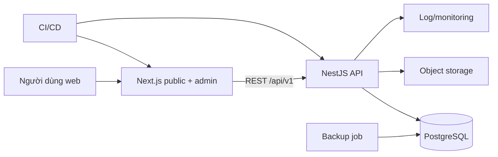
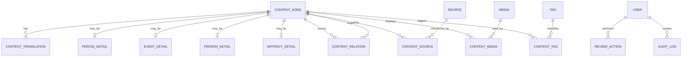

# Kế hoạch xây dựng Website Lịch sử Quân sự Việt Nam song ngữ Việt – Anh

> Phiên bản: 1.0  
> Ngày lập: 06/08/2026  
> Trạng thái: Bản kế hoạch cơ sở, cần chốt phạm vi với giảng viên hướng dẫn trước khi lập trình  
> Nguồn yêu cầu: [Phiếu giao đề tài](/Users/admin/Downloads/doan/12.NguyenDucNam_2101189_Phieugiaodetai_2026.pdf)

## 1. Tóm tắt điều hành

Đề tài xây dựng một website công khai giúp người Việt Nam và người nước ngoài tìm hiểu, tra cứu Lịch sử Quân sự Việt Nam bằng hai ngôn ngữ Việt – Anh. Hệ thống gồm hai phần chính:

1. Website công khai: giới thiệu nội dung lịch sử theo thời kỳ, sự kiện, nhân vật và hiện vật; có timeline, tìm kiếm, bộ lọc và chuyển đổi ngôn ngữ.
2. Hệ thống quản trị: cho phép biên tập, dịch, kiểm chứng nguồn, duyệt và xuất bản nội dung; quản lý hình ảnh, tài liệu và tài khoản theo vai trò.

Điểm khó nhất của đề tài không nằm ở CRUD mà ở bốn vấn đề: dữ liệu lịch sử phải có nguồn, hai bản ngôn ngữ phải đồng bộ, tìm kiếm tiếng Việt phải hữu dụng, và quy trình xuất bản phải ngăn nội dung chưa kiểm chứng xuất hiện trên website.

Phương án MVP được đề xuất cho một sinh viên thực hiện trong khoảng 16 tuần. Nếu thời gian ngắn hơn, giảm số lượng nội dung ban đầu nhưng không cắt trích nguồn, quy trình duyệt, bảo mật quản trị hoặc kiểm thử.

## 2. Phân tích yêu cầu từ phiếu giao đề tài

### 2.1. Mục tiêu nghiệp vụ

- Cung cấp nguồn tham khảo trực quan, dễ tra cứu về Lịch sử Quân sự Việt Nam.
- Phục vụ học tập và nghiên cứu ở mức phổ thông/đại học cơ sở.
- Giới thiệu lịch sử đến người dùng quốc tế qua nội dung tiếng Anh.
- Cho phép người quản trị duy trì nội dung lâu dài mà không sửa mã nguồn.
- Thể hiện đầy đủ năng lực phân tích, thiết kế, frontend, backend, cơ sở dữ liệu, kiểm thử, bảo mật và triển khai.

### 2.2. Đối tượng sử dụng

| Đối tượng | Nhu cầu chính | Vấn đề cần giải quyết |
|---|---|---|
| Học sinh, sinh viên Việt Nam | Tìm sự kiện, nhân vật, mốc thời gian để học tập | Nội dung phân tán, khó nhìn quan hệ thời gian |
| Người dùng quốc tế | Đọc nội dung tiếng Anh và hiểu bối cảnh Việt Nam | Thiếu bản dịch nhất quán và thuật ngữ chuẩn |
| Người nghiên cứu/giảng viên | Xem nguồn, ngày tháng, quan hệ giữa các nội dung | Nội dung web thường thiếu trích dẫn hoặc nguồn gốc ảnh |
| Biên tập viên | Tạo và cập nhật nội dung Việt – Anh | Hai bản dịch dễ lệch trạng thái hoặc thất lạc nguồn |
| Người duyệt nội dung | Kiểm chứng trước khi công bố | Cần biết ai sửa gì và bản nào đã được duyệt |
| Quản trị viên | Quản lý tài khoản, phân quyền và vận hành | Khu vực quản trị phải an toàn và có nhật ký thao tác |

### 2.3. Vấn đề cốt lõi cần giải quyết

- Tra cứu theo từ khóa đơn thuần chưa đủ; người dùng cần lọc theo thời kỳ, loại nội dung, địa điểm và chủ đề.
- Nội dung lịch sử phải thể hiện nguồn tham khảo, người kiểm duyệt và thời điểm cập nhật.
- Chuyển ngôn ngữ phải giữ nguyên nội dung/ngữ cảnh đang xem, không đưa người dùng về trang chủ.
- Không được coi bản dịch tự động là nội dung đã kiểm chứng; bản dịch chỉ được xuất bản sau khi có người duyệt.
- Hình ảnh phải có chú thích, nguồn, quyền sử dụng và văn bản thay thế cho khả năng tiếp cận.
- Quản trị nội dung cần workflow thay vì chỉ có nút “Lưu”.

## 3. Kết quả nghiên cứu và bài học áp dụng

### 3.1. Website tham chiếu

- [Bảo tàng Lịch sử Quốc gia Việt Nam](https://vnmh.com.vn/en) cho thấy nhu cầu tổ chức nội dung song ngữ theo trưng bày, hiện vật, nhân vật và bài nghiên cứu. Trang quản lý bộ sưu tập cũng mô tả việc số hóa, lập hồ sơ và phân loại hiện vật một cách khoa học.
- [Imperial War Museums Collections](https://www.iwm.org.uk/collections/) tổ chức kho dữ liệu theo nhiều loại media; [hướng dẫn tìm kiếm](https://www.iwm.org.uk/collections/how-to) sử dụng bộ lọc loại hiện vật và thời kỳ liên quan. Đây là mẫu phù hợp cho chức năng tra cứu của đề tài.
- [Heilbrunn Timeline of Art History](https://www.metmuseum.org/essays/timeline-of-art-history) kết hợp khám phá theo thời gian, chủ đề và địa lý. Bài học áp dụng là timeline phải dẫn tới các trang chi tiết chứ không chỉ là hiệu ứng trình diễn.
- Một [phản hồi thực tế về Bảo tàng Lịch sử Quân sự Việt Nam](https://www.reddit.com/r/hanoi/comments/1sz02wu/opening_hours_for_vietnam_military_history_museum/) cho biết người dùng khó tìm website chính thức. Vì vậy SEO, URL rõ ràng, metadata song ngữ và khả năng tìm thấy nguồn chính thức phải được coi là yêu cầu sản phẩm.

### 3.2. Nguyên tắc rút ra

- Tổ chức nội dung theo thực thể và quan hệ, không chỉ đăng bài tin tức.
- Timeline, danh sách, bộ lọc và tìm kiếm phải dùng chung một kho dữ liệu.
- Mỗi nội dung công khai phải có nguồn và trạng thái kiểm duyệt.
- Hai ngôn ngữ là hai phiên bản có trạng thái riêng nhưng cùng một thực thể lịch sử.
- MVP ưu tiên dữ liệu có cấu trúc và trải nghiệm tra cứu; 3D, VR/AR hoặc AI chỉ là hướng phát triển.

## 4. Phạm vi sản phẩm

### 4.1. Phạm vi MVP bắt buộc

| Mã | Chức năng | Ưu tiên | Mức độ | Điều kiện hoàn thành |
|---|---|---:|---:|---|
| FR01 | Trang chủ giới thiệu, nội dung nổi bật và điểm vào timeline | P0 | B | Hiển thị responsive bằng Việt/Anh, dữ liệu lấy từ API |
| FR02 | Duyệt lịch sử theo timeline/thời kỳ | P0 | B | Chọn thời kỳ và mở được sự kiện liên quan |
| FR03 | Danh sách và trang chi tiết sự kiện/chiến dịch | P0 | B | Có thời gian, địa điểm, mô tả, quan hệ, nguồn và media |
| FR04 | Danh sách và trang chi tiết nhân vật | P0 | B | Có tiểu sử tóm tắt, vai trò, nội dung liên quan và nguồn |
| FR05 | Danh sách và trang chi tiết hiện vật/tư liệu | P0 | B | Có metadata, nguồn ảnh/quyền sử dụng và nội dung liên quan |
| FR06 | Tìm kiếm và lọc | P0 | B | Tìm không dấu/có dấu; lọc theo loại, thời kỳ, chủ đề |
| FR07 | Chuyển Việt – Anh giữ nguyên trang đang xem | P0 | B | Chuyển locale đúng cặp nội dung; báo rõ nếu bản dịch chưa công bố |
| FR08 | Đăng nhập quản trị và phân quyền | P0 | B | Admin, Editor, Reviewer chỉ dùng được quyền được cấp |
| FR09 | CRUD nội dung và bản dịch | P0 | B | Tạo, sửa, xem trước, lưu nháp; validation đầy đủ |
| FR10 | Workflow Draft → In review → Published/Rejected | P0 | B | Chỉ Reviewer/Admin được duyệt và xuất bản |
| FR11 | Quản lý nguồn trích dẫn và media | P0 | B | Không thể xuất bản nếu thiếu nguồn hoặc metadata ảnh bắt buộc |
| FR12 | SEO song ngữ, sitemap và chia sẻ mạng xã hội | P1 | A | Canonical, `hreflang`, metadata và sitemap đúng cho VI/EN |
| FR13 | Nhật ký thao tác quản trị | P1 | B | Ghi người, hành động, đối tượng và thời gian cho thao tác quan trọng |
| FR14 | Sao lưu và khôi phục dữ liệu | P1 | B | Có backup tự động và một lần diễn tập restore thành công |

Giải thích mức độ: A = đơn giản, B = trung bình, C = phức tạp/rủi ro cao.

### 4.2. Bộ dữ liệu demo tối thiểu

Mục tiêu trước ngày nghiệm thu là ít nhất 50 nội dung đã xuất bản, mỗi nội dung có bản Việt và Anh, có tối thiểu một nguồn:

- 6 thời kỳ lịch sử.
- 20 sự kiện/chiến dịch/trận đánh.
- 10 nhân vật.
- 10 hiện vật/tư liệu.
- 4 bài giới thiệu/chuyên đề.

Số lượng có thể giảm khi giảng viên ưu tiên chất lượng học thuật, nhưng mọi nội dung được tính vào nghiệm thu phải hoàn tất cả hai ngôn ngữ và kiểm duyệt nguồn.

### 4.3. Ngoài phạm vi MVP

- Tài khoản, bình luận, đánh giá hoặc đóng góp nội dung từ công chúng.
- Mạng xã hội nội bộ, diễn đàn hoặc nhắn tin.
- AI chatbot/RAG, tự động dịch rồi tự xuất bản.
- VR/AR, tour 3D, nhận diện hiện vật bằng camera.
- Bản đồ GIS nâng cao hoặc mô phỏng diễn biến trận đánh thời gian thực.
- Ứng dụng mobile native.
- Thanh toán, bán vé hoặc thương mại điện tử.
- Hệ thống thư viện số quy mô hàng trăm nghìn bản ghi.

Các mục trên chỉ được đưa vào sau khi MVP chạy ổn định. Đặc biệt, AI, VR/AR và GIS là hạng mục C, có thể làm trễ toàn bộ đồ án.

### 4.4. Quyết định phạm vi

Đề xuất: **GO với MVP nêu trên**. Điều kiện bắt đầu code là giảng viên hướng dẫn xác nhận ba điểm:

1. Nhóm thực thể lịch sử chính có đúng với kỳ vọng chuyên môn không.
2. Số lượng 50 nội dung song ngữ có phù hợp quỹ thời gian không.
3. Ai là người chịu trách nhiệm kiểm chứng nội dung và bản dịch tiếng Anh.

## 5. Yêu cầu phi chức năng

| Nhóm | Chỉ tiêu đề xuất |
|---|---|
| Hiệu năng | Trang công khai quan trọng đạt LCP ≤ 2,5 giây ở môi trường production mục tiêu; API đọc phổ biến p95 ≤ 500 ms với bộ dữ liệu demo; tìm kiếm p95 ≤ 1 giây |
| Khả dụng | Responsive từ 360 px; hoạt động trên hai phiên bản gần nhất của Chrome, Edge, Firefox và Safari |
| Tiếp cận | Các luồng chính đáp ứng checklist WCAG 2.2 AA: bàn phím, focus, tương phản, alt text, nhãn form, heading đúng cấp |
| Bảo mật | HTTPS; mật khẩu băm; cookie HttpOnly/Secure; rate limit đăng nhập; RBAC; validate input; không có lỗ hổng mức Critical/High chưa xử lý |
| Dữ liệu | Migration có version; dữ liệu production không reset; backup theo lịch; restore đã được thử |
| Song ngữ | 100% nội dung đã Published có title, summary, body và SEO metadata cho locale tương ứng |
| Nội dung | 100% nội dung đã Published có ít nhất một nguồn và thông tin kiểm duyệt |
| SEO | URL có locale; canonical và `hreflang` hai chiều; sitemap; robots; Open Graph; structured data phù hợp |
| Quan sát | Có log lỗi backend, log đăng nhập thất bại và health check; không ghi mật khẩu/token vào log |
| Bảo trì | Có README, tài liệu môi trường, OpenAPI, seed demo và hướng dẫn backup/restore |

Tham chiếu kỹ thuật: [WCAG 2.2](https://www.w3.org/TR/WCAG22/), [Google Search về trang đa ngôn ngữ](https://developers.google.com/search/docs/specialty/international/localized-versions), và [OWASP Top 10:2025](https://owasp.org/Top10/).

## 6. Kiến trúc thông tin và luồng người dùng

### 6.1. Sitemap công khai

```text
/{locale}
├── gioi-thieu | about
├── timeline
├── thoi-ky | periods
│   └── /{slug}
├── su-kien | events
│   └── /{slug}
├── nhan-vat | people
│   └── /{slug}
├── hien-vat | artifacts
│   └── /{slug}
├── chuyen-de | topics
│   └── /{slug}
├── tim-kiem | search
└── nguon-tu-lieu | sources
```

URL hiển thị có thể bản địa hóa theo ngôn ngữ, nhưng hệ thống phải có route key ổn định để chuyển `/vi/.../{slug-vi}` sang đúng `/en/.../{slug-en}`.

### 6.2. Sitemap quản trị

```text
/admin
├── login
├── dashboard
├── contents
│   ├── create
│   └── /{id}/edit
├── review-queue
├── media
├── sources
├── taxonomies
├── users
└── audit-logs
```

### 6.3. Luồng công khai quan trọng

1. Người dùng vào trang chủ → chọn timeline → chọn thời kỳ → mở sự kiện → xem nhân vật/hiện vật liên quan → xem nguồn.
2. Người dùng nhập từ khóa không dấu → lọc loại “Sự kiện” và thời kỳ → mở kết quả → chuyển sang tiếng Anh nhưng vẫn ở đúng sự kiện.
3. Người dùng quốc tế vào URL tiếng Anh từ công cụ tìm kiếm → xem tóm tắt → duyệt nội dung liên quan → hiểu nguồn và ngày cập nhật.

### 6.4. Luồng biên tập quan trọng

1. Editor tạo nội dung gốc tiếng Việt → thêm nguồn và media → bổ sung bản tiếng Anh → gửi duyệt.
2. Reviewer kiểm tra nội dung, nguồn, bản dịch và preview → duyệt hoặc trả lại kèm lý do.
3. Hệ thống xuất bản đồng thời hoặc theo locale; mọi thay đổi trạng thái được ghi audit log.
4. Khi sửa nội dung đã xuất bản, hệ thống tạo bản nháp mới hoặc đưa phiên bản đó về trạng thái cần duyệt; không âm thầm thay nội dung công khai.

## 7. Đề xuất kiến trúc kỹ thuật

### 7.1. Stack đề xuất

| Lớp | Công nghệ đề xuất | Lý do |
|---|---|---|
| Frontend | Next.js App Router + TypeScript | SSR/SSG tốt cho SEO, routing locale, tối ưu ảnh và tổ chức UI rõ ràng |
| UI | Tailwind CSS hoặc CSS Modules; component tự xây dựng có kiểm soát | Nhanh triển khai, dễ tạo responsive và design token |
| Backend | NestJS + TypeScript + REST | Module hóa rõ, validation/guard/OpenAPI phù hợp đồ án backend |
| Cơ sở dữ liệu | PostgreSQL | Dữ liệu quan hệ, transaction, tìm kiếm và indexing tốt |
| ORM/migration | Prisma | Schema rõ, migration có lịch sử, type-safe giữa code và dữ liệu |
| Media | S3-compatible storage hoặc Cloudinary | Không lưu file upload trực tiếp trong database/repository |
| Tìm kiếm MVP | PostgreSQL `unaccent` + `pg_trgm`/full-text index | Đủ cho bộ dữ liệu đồ án; hỗ trợ từ khóa có/không dấu |
| API contract | OpenAPI/Swagger | Frontend và backend dùng một contract, giảm lệch tên field |
| Test | Unit/integration + Playwright E2E | Bao phủ logic, API và luồng người dùng thực |
| CI/CD | GitHub Actions | Tự động lint, test, build và migration check |
| Triển khai | Docker; frontend/backend/database tách service | Môi trường nhất quán, dễ demo và chuyển host |

[Hướng dẫn i18n của Next.js](https://nextjs.org/docs/app/guides/internationalization) hỗ trợ route theo locale. Nếu nhóm đã thành thạo một stack khác như Laravel + React/Vue, có thể thay công nghệ nhưng phải giữ nguyên data model, API contract, workflow nội dung và tiêu chí nghiệm thu.

### 7.2. Sơ đồ kiến trúc



### 7.3. Cấu trúc repository dự kiến

```text
root/
├── apps/
│   ├── web/                 # Next.js public + admin UI
│   └── api/                 # NestJS REST API
├── packages/
│   ├── contracts/           # DTO/schema sinh hoặc đồng bộ từ OpenAPI
│   ├── ui/                  # Component dùng chung
│   └── config/              # ESLint/TypeScript config
├── prisma/
│   ├── schema.prisma
│   ├── migrations/
│   └── seed.ts
├── docs/
│   ├── openapi.yaml
│   ├── erd.md
│   └── deployment.md
├── docker-compose.yml
└── README.md
```

## 8. Mô hình dữ liệu đề xuất

### 8.1. Các bảng chính

| Bảng | Trường/ý nghĩa chính |
|---|---|
| `content_nodes` | Thực thể gốc: `id`, `type`, `status`, `featured`, `published_at`, `created_by`, `reviewed_by`, timestamps |
| `content_translations` | Bản dịch: `content_id`, `locale`, `title`, `slug`, `summary`, `body`, SEO fields, `translation_status` |
| `period_details` | Mốc bắt đầu/kết thúc và thứ tự hiển thị của thời kỳ |
| `event_details` | Ngày bắt đầu/kết thúc, độ chính xác của ngày, kết quả/tóm tắt sự kiện |
| `person_details` | Năm sinh/mất, chức danh/vai trò và các trường có cấu trúc |
| `artifact_details` | Loại, niên đại, chất liệu, nơi lưu giữ, mã kiểm kê nếu có |
| `locations` | Tên chuẩn, tọa độ tùy chọn, địa danh hiện tại/lịch sử |
| `content_relations` | Quan hệ giữa hai nội dung: thuộc thời kỳ, tham gia sự kiện, liên quan, kế tiếp... |
| `tags`, `content_tags` | Chủ đề và gắn chủ đề |
| `sources`, `content_sources` | Tác giả/cơ quan, nhan đề, năm, URL/ISBN, trang trích dẫn, ngày truy cập, cấp độ tin cậy |
| `media`, `content_media` | File, loại, kích thước, credit, license, alt/caption theo locale, thứ tự hiển thị |
| `users`, `roles`, `user_roles` | Tài khoản và RBAC |
| `review_actions` | Lịch sử gửi duyệt, duyệt, từ chối và ghi chú |
| `audit_logs` | Hành động quản trị quan trọng, đối tượng, thời điểm, IP đã rút gọn nếu cần |

### 8.2. Quan hệ dữ liệu



### 8.3. Quy tắc dữ liệu bắt buộc

- Khóa duy nhất `(content_id, locale)` cho bản dịch; slug duy nhất trong cùng locale và loại nội dung.
- Không xóa cứng nội dung đã xuất bản; dùng soft delete/archive.
- Nội dung chỉ được Published khi có bản dịch yêu cầu, nguồn, người duyệt và media hợp lệ nếu có.
- Ngày lịch sử có thể chỉ biết năm/tháng, vì vậy không ép mọi mốc vào một ngày chính xác giả tạo; lưu `date_precision`.
- Trường lịch sử có tranh luận phải cho phép ghi chú diễn giải và nhiều nguồn.
- Mỗi ảnh cần `credit`, `license/permission`, nguồn và `alt` cho locale được xuất bản.
- Audit log không lưu mật khẩu, token hoặc nội dung nhạy cảm không cần thiết.

## 9. API contract sơ bộ

API chính thức phải được mô tả trong `openapi.yaml` trước khi frontend/backend triển khai độc lập. Tất cả response lỗi dùng chung dạng `{ code, message, details?, requestId }`.

### 9.1. Public API

| Method | Path | Access | Mục đích |
|---|---|---|---|
| GET | `/healthz` | Public | Health check |
| GET | `/api/v1/{locale}/home` | Public | Nội dung trang chủ |
| GET | `/api/v1/{locale}/periods` | Public | Danh sách thời kỳ |
| GET | `/api/v1/{locale}/timeline` | Public | Timeline có lọc khoảng thời gian/chủ đề |
| GET | `/api/v1/{locale}/contents` | Public | Danh sách theo `type`, `period`, `tag`, `page` |
| GET | `/api/v1/{locale}/contents/{type}/{slug}` | Public | Chi tiết, quan hệ, media và nguồn |
| GET | `/api/v1/{locale}/search` | Public | Tìm `q`, lọc `type`, `period`, `tag`, phân trang |
| GET | `/api/v1/{locale}/taxonomies` | Public | Dữ liệu bộ lọc |
| GET | `/api/v1/contents/{id}/alternate` | Public | Lấy URL cặp VI/EN đã xuất bản |

### 9.2. Authentication và Admin API

| Method | Path | Access | Mục đích |
|---|---|---|---|
| POST | `/api/v1/auth/login` | Public + rate limit | Đăng nhập quản trị |
| POST | `/api/v1/auth/logout` | Authenticated | Hủy session |
| GET | `/api/v1/auth/me` | Authenticated | Tài khoản và quyền hiện tại |
| GET/POST | `/api/v1/admin/contents` | Editor+ | Danh sách/tạo nội dung |
| GET/PATCH | `/api/v1/admin/contents/{id}` | Editor+ | Xem/sửa nội dung |
| PUT | `/api/v1/admin/contents/{id}/translations/{locale}` | Editor+ | Lưu bản dịch |
| POST | `/api/v1/admin/contents/{id}/submit-review` | Editor+ | Gửi duyệt |
| POST | `/api/v1/admin/contents/{id}/approve` | Reviewer+ | Duyệt nội dung |
| POST | `/api/v1/admin/contents/{id}/reject` | Reviewer+ | Từ chối kèm lý do |
| POST | `/api/v1/admin/contents/{id}/publish` | Reviewer+ | Xuất bản |
| POST/GET | `/api/v1/admin/media` | Editor+ | Upload/lấy media |
| GET/POST/PATCH | `/api/v1/admin/sources` | Editor+ | Quản lý nguồn |
| GET/POST/PATCH | `/api/v1/admin/users` | Admin | Quản lý tài khoản/quyền |
| GET | `/api/v1/admin/audit-logs` | Admin | Tra cứu nhật ký |

### 9.3. Shape tối thiểu cần khóa trước khi code

```ts
type Locale = "vi" | "en";
type ContentType = "PERIOD" | "EVENT" | "PERSON" | "ARTIFACT" | "TOPIC";
type WorkflowStatus = "DRAFT" | "IN_REVIEW" | "APPROVED" | "PUBLISHED" | "REJECTED" | "ARCHIVED";

interface ContentListItem {
  id: string;
  type: ContentType;
  locale: Locale;
  title: string;
  slug: string;
  summary: string;
  thumbnail: MediaView | null;
  startDate: string | null;
  endDate: string | null;
  period: { id: string; title: string; slug: string } | null;
}

interface ContentDetail extends ContentListItem {
  body: string;
  media: MediaView[];
  sources: SourceView[];
  related: ContentListItem[];
  alternate: { locale: Locale; url: string } | null;
  publishedAt: string;
  updatedAt: string;
}
```

## 10. Quy trình nội dung và tiêu chuẩn học thuật

### 10.1. Thứ tự ưu tiên nguồn

1. Tài liệu của cơ quan nhà nước, bảo tàng, lưu trữ, Viện Lịch sử Quân sự, nhà xuất bản chính thống.
2. Sách/chuyên khảo học thuật và bài báo khoa học có tác giả, nhà xuất bản, năm và trang rõ ràng.
3. Báo chí uy tín dùng để bổ trợ bối cảnh hiện đại, không thay thế nguồn sử học.
4. Wikipedia có thể dùng để tìm đầu mối nhưng không dùng làm nguồn duy nhất cho nội dung xuất bản.

### 10.2. Checklist trước khi xuất bản

- Tên riêng, niên đại, địa điểm và thuật ngữ đã đối chiếu.
- Có ít nhất một nguồn; thông tin quan trọng/tranh luận nên có từ hai nguồn.
- Trích dẫn ghi đủ cơ quan/tác giả, nhan đề, năm, trang hoặc URL và ngày truy cập.
- Bản tiếng Anh giữ nghĩa, không dịch máy nguyên trạng, có bảng thuật ngữ thống nhất.
- Ảnh có quyền sử dụng/permission, credit, caption và alt text.
- Nội dung không chứa HTML/script nguy hiểm; liên kết ngoài hợp lệ.
- Reviewer ghi nhận quyết định duyệt; ngày cập nhật được hiển thị.

### 10.3. Trạng thái bản dịch

`NOT_STARTED → TRANSLATING → READY_FOR_REVIEW → APPROVED → PUBLISHED`

Trạng thái bản dịch độc lập với trạng thái bản gốc. Nếu bản tiếng Anh chưa Published, nút đổi ngôn ngữ phải thông báo rõ thay vì dẫn đến 404 hoặc một bài khác.

## 11. Backlog task từ đầu đến cuối

Quy ước kích thước: S ≤ 0,5 ngày; M = 1–2 ngày; L = 3–5 ngày. Mỗi task chỉ được đóng khi có đầu ra và tiêu chí nghiệm thu nêu trong bảng, không chỉ vì đã viết code.

### Giai đoạn A — Khởi động và xác nhận yêu cầu

| ID | Task | Đầu ra/tiêu chí nghiệm thu | Phụ thuộc | Size |
|---|---|---|---|---:|
| A01 | Đọc phiếu giao đề tài và lập requirement traceability | Mọi yêu cầu trong PDF được ánh xạ tới chức năng hoặc tài liệu | — | S |
| A02 | Phỏng vấn giảng viên/người phụ trách nội dung | Chốt người duyệt, phạm vi lịch sử, nguồn được chấp nhận và deadline | A01 | M |
| A03 | Chốt persona và ba user journey chính | Persona có mục tiêu, bối cảnh và task cần hoàn thành | A02 | S |
| A04 | Khảo sát ít nhất ba website tham chiếu | Có ảnh/chú thích, điểm mạnh/yếu và bài học áp dụng | A01 | M |
| A05 | Chốt MVP và cut list | Có văn bản GO/KILL, 50 nội dung mục tiêu và danh sách ngoài phạm vi | A02,A04 | M |
| A06 | Chốt chỉ số thành công và Definition of Done | Mỗi chỉ số có số đo, cách đo và thời điểm đo | A05 | S |
| A07 | Lập risk register và lịch review hằng tuần | Mỗi rủi ro có owner, xác suất, tác động, phương án | A05 | S |

### Giai đoạn B — Nội dung, UX và giao diện

| ID | Task | Đầu ra/tiêu chí nghiệm thu | Phụ thuộc | Size |
|---|---|---|---|---:|
| B01 | Thiết kế taxonomy lịch sử | Chốt period, event, person, artifact, topic, tag và relation types | A05 | M |
| B02 | Lập sitemap và route map VI/EN | Mỗi trang có route key và cặp URL locale | A03,B01 | M |
| B03 | Vẽ user flow công khai và quản trị | Bao phủ tìm kiếm, đổi ngôn ngữ, tạo–duyệt–xuất bản | B02 | M |
| B04 | Wireframe mobile cho các trang chính | Home, timeline, listing, detail, search, admin editor | B03 | L |
| B05 | Wireframe desktop và responsive rules | Có breakpoint, navigation, filter và content hierarchy | B04 | M |
| B06 | Xây design system | Màu, type scale, spacing, icon, component states; đạt contrast mục tiêu | B04 | M |
| B07 | Prototype tương tác và usability test với 5 người | ≥80% hoàn thành tìm sự kiện và đổi ngôn ngữ không cần trợ giúp | B05,B06 | L |
| B08 | Chốt thiết kế UI với giảng viên | Có biên bản duyệt và danh sách sửa cuối | B07 | S |

### Giai đoạn C — Kiến trúc, dữ liệu và hợp đồng

| ID | Task | Đầu ra/tiêu chí nghiệm thu | Phụ thuộc | Size |
|---|---|---|---|---:|
| C01 | Viết ADR chọn stack và deployment target | Ghi lựa chọn, lý do, phương án bị loại và trade-off | A05 | M |
| C02 | Thiết kế ERD và data dictionary | Mọi FR có dữ liệu lưu trữ; khóa/index/nullable rõ ràng | B01,C01 | L |
| C03 | Thiết kế workflow nội dung và RBAC matrix | Role × action rõ; transition trái phép bị từ chối | A02,C02 | M |
| C04 | Viết OpenAPI public API | Có request/response/error/pagination/filter example | C02 | L |
| C05 | Viết OpenAPI auth/admin API | Có auth, role, validation, workflow và upload contract | C03,C04 | L |
| C06 | Review contract chéo frontend–backend–data | Không còn field lệch tên, FR mồ côi hoặc endpoint thiếu quyền | C04,C05 | M |
| C07 | Lập test strategy và acceptance matrix | Mỗi FR được ánh xạ ít nhất một test | A06,C06 | M |

### Giai đoạn D — Nền tảng dự án

| ID | Task | Đầu ra/tiêu chí nghiệm thu | Phụ thuộc | Size |
|---|---|---|---|---:|
| D01 | Khởi tạo Git repository/monorepo | Branch policy, `.gitignore`, license và cấu trúc đúng ADR | C01 | M |
| D02 | Khởi tạo Next.js web | Lint/build chạy; có layout locale và error/loading boundary | D01,B08 | M |
| D03 | Khởi tạo NestJS API | `/healthz`, validation pipe, error format và Swagger chạy | D01,C06 | M |
| D04 | Cấu hình PostgreSQL, Prisma và migration đầu | DB khởi tạo từ migration trên máy sạch | C02,D03 | M |
| D05 | Cấu hình Docker Compose local | Web, API, DB chạy bằng một tài liệu lệnh thống nhất | D02,D03,D04 | M |
| D06 | Cấu hình quality tools | Formatter, lint, typecheck, pre-commit hoặc CI checks hoạt động | D01 | S |
| D07 | Tạo CI pipeline | Pull request chạy lint, typecheck, unit test, build, migration check | D02,D03,D04,D06 | M |
| D08 | Thiết lập config/secrets | Có `.env.example`; không commit secret; phân biệt dev/test/prod | D05 | S |
| D09 | Tạo seed tài khoản và dữ liệu mẫu tối thiểu | Seed lặp lại an toàn; credential demo không dùng ở production | D04,D08 | M |

### Giai đoạn E — Backend và cơ sở dữ liệu

| ID | Task | Đầu ra/tiêu chí nghiệm thu | Phụ thuộc | Size |
|---|---|---|---|---:|
| E01 | Implement user, session và password security | Login/logout/me; hash mạnh; cookie an toàn; rate limit | D04,C03 | L |
| E02 | Implement guards và RBAC | Test chứng minh Editor không publish, Reviewer không quản lý user | E01 | M |
| E03 | Implement content nodes và translations | CRUD, unique slug, locale validation, soft delete | D04,C05 | L |
| E04 | Implement subtype details | Period/event/person/artifact validation đúng data dictionary | E03 | L |
| E05 | Implement tags, locations và relations | Không tạo relation lỗi/trùng; API trả related content | E03,E04 | M |
| E06 | Implement sources và publish validation | Nội dung thiếu nguồn không publish được | E03 | M |
| E07 | Implement media metadata và upload flow | Kiểm tra MIME/size; lưu storage; credit/license/alt | E03,D08 | L |
| E08 | Implement review workflow | Transition đúng; reject phải có lý do; ghi reviewer/time | E02,E03,E06,E07 | L |
| E09 | Implement public listing/detail API | Chỉ trả Published; phân trang/filter ổn định | E04,E05,E06 | L |
| E10 | Implement timeline API | Sắp xếp theo mốc; xử lý date precision; filter period/tag | E04,E09 | M |
| E11 | Implement search tiếng Việt/Anh | Không dấu/có dấu; index; ranking; pagination; query rỗng an toàn | E09 | L |
| E12 | Implement alternate locale resolver | Trả đúng URL cặp ngôn ngữ hoặc `null` nếu chưa publish | E03,E09 | M |
| E13 | Implement home/taxonomy APIs | Dữ liệu featured và filter không hard-code ở frontend | E05,E09 | M |
| E14 | Implement audit logs | Ghi login, create/update, role, approve, publish, archive | E01,E02,E08 | M |
| E15 | Viết unit/integration/contract tests backend | Luồng chính và quyền có test; response khớp OpenAPI | E01-E14 | L |

### Giai đoạn F — Frontend công khai

| ID | Task | Đầu ra/tiêu chí nghiệm thu | Phụ thuộc | Size |
|---|---|---|---|---:|
| F01 | Xây app shell responsive | Header/footer/navigation/breadcrumb/skip link đúng thiết kế | D02,B08 | M |
| F02 | Implement i18n UI và locale routing | UI dictionary VI/EN; URL có locale; fallback rõ ràng | F01,C06 | L |
| F03 | Xây component library | Button, input, card, filters, pagination, modal, status/error | B06,F01 | L |
| F04 | Xây trang chủ | Featured content, intro và CTA timeline dùng API | E13,F02,F03 | M |
| F05 | Xây timeline | Keyboard usable; responsive; mở đúng detail; không chỉ là animation | E10,F03 | L |
| F06 | Xây listing/filter cho các loại nội dung | URL giữ filter; loading/empty/error states; pagination | E09,F03 | L |
| F07 | Xây trang chi tiết | Body, metadata, source, media, related và ngày cập nhật | E09,F03 | L |
| F08 | Xây chuyển ngôn ngữ theo cặp nội dung | Giữ context; xử lý bản dịch chưa Published | E12,F02,F07 | M |
| F09 | Xây trang tìm kiếm | Debounce hoặc submit rõ; filter; highlight an toàn; no-result tips | E11,F03 | L |
| F10 | Xây trang nguồn/giới thiệu/chính sách | Hiển thị phương pháp biên tập, nguồn, quyền media | F02,F03 | M |
| F11 | Implement SEO song ngữ | Metadata, canonical, hreflang, sitemap, robots, OG/JSON-LD | F04-F10 | L |
| F12 | Accessibility pass frontend | Bàn phím, focus, heading, labels, contrast, alt và reduced motion | F04-F10 | L |
| F13 | Performance pass frontend | Tối ưu ảnh/font/cache/bundle; đo production-like đạt mục tiêu | F04-F11 | M |

### Giai đoạn G — Giao diện quản trị

| ID | Task | Đầu ra/tiêu chí nghiệm thu | Phụ thuộc | Size |
|---|---|---|---|---:|
| G01 | Xây login và session UX | Lỗi không lộ thông tin; redirect hợp lệ; logout xóa session | E01,F03 | M |
| G02 | Xây admin layout/dashboard | Menu thay đổi theo role; số liệu workflow thật | E02,E13,G01 | M |
| G03 | Xây content list | Filter type/status/locale/author; pagination; action theo quyền | E03,E08,G02 | M |
| G04 | Xây content editor Việt–Anh | Form có autosave hoặc cảnh báo mất dữ liệu; preview; validation | E03-E07,G03 | L |
| G05 | Xây relation/tag/location/source editors | Tìm và gắn quan hệ; không tạo bản ghi trùng | E05,E06,G04 | L |
| G06 | Xây media library/uploader | Preview, progress, validation, credit/license/alt bắt buộc | E07,G04 | L |
| G07 | Xây review queue và diff/preview | Reviewer duyệt/từ chối; thấy đủ nguồn và hai bản dịch | E08,G04 | L |
| G08 | Xây user/role management | Chỉ Admin truy cập; không tự xóa admin cuối cùng | E02,G02 | M |
| G09 | Xây audit log viewer | Filter actor/action/date/object; không hiện secret | E14,G02 | M |
| G10 | Viết test component/E2E admin | Bao phủ create → translate → review → publish và deny quyền | G01-G09 | L |

### Giai đoạn H — Chuẩn bị nội dung song ngữ

Giai đoạn này bắt đầu ngay sau B01 và chạy song song với lập trình; nếu chờ code xong mới nhập nội dung, đồ án rất dễ trễ.

| ID | Task | Đầu ra/tiêu chí nghiệm thu | Phụ thuộc | Size |
|---|---|---|---|---:|
| H01 | Tạo content template và citation style | Có mẫu cho từng type, quy tắc tên riêng/ngày/nguồn | B01,A02 | M |
| H02 | Tạo glossary Việt–Anh | Thuật ngữ quân sự, tên chiến dịch, địa danh và quy tắc phiên âm | H01 | L |
| H03 | Lập danh mục 50 nội dung và source inventory | Mỗi item có type, owner, nguồn dự kiến và trạng thái | H01,A05 | M |
| H04 | Xử lý quyền hình ảnh/media | Mỗi file có license/permission/credit; loại bỏ file không rõ quyền | H03 | L |
| H05 | Biên soạn 6 thời kỳ và 20 sự kiện | Nội dung Việt có nguồn, được reviewer chuyên môn kiểm tra | H03 | L |
| H06 | Biên soạn 10 nhân vật, 10 hiện vật, 4 chuyên đề | Nội dung Việt có nguồn, đúng template | H03 | L |
| H07 | Dịch toàn bộ nội dung sang tiếng Anh | Theo glossary; không publish bản dịch máy chưa duyệt | H02,H05,H06 | L |
| H08 | Review chéo sự thật và bản dịch | 100% item có checklist, reviewer, nguồn và trạng thái | H04,H07 | L |
| H09 | Import/nhập dữ liệu vào staging | Báo cáo tổng số, lỗi import = 0, kiểm tra ngẫu nhiên 20% | E03-E08,H08 | M |
| H10 | Content QA trên giao diện thật | Không vỡ layout, link/source/media/alternate locale hợp lệ | F07-F10,H09 | L |

### Giai đoạn I — Kiểm thử, bảo mật và hoàn thiện

| ID | Task | Đầu ra/tiêu chí nghiệm thu | Phụ thuộc | Size |
|---|---|---|---|---:|
| I01 | Hoàn thiện unit test | Logic date, slug, workflow, permission, search normalization được test | E15,G10 | M |
| I02 | Chạy integration và API contract test | Migration + DB thật; API không lệch OpenAPI | I01,C06 | M |
| I03 | Viết E2E public flows | Timeline, search, filter, detail, đổi locale chạy tự động | F04-F10 | L |
| I04 | Viết E2E admin workflow | Login, CRUD, review, publish, RBAC chạy tự động | G10 | L |
| I05 | Kiểm thử accessibility | Axe tự động + keyboard/screen-reader smoke; không còn lỗi nghiêm trọng | F12,I03 | M |
| I06 | Kiểm thử responsive/cross-browser | Ma trận thiết bị/trình duyệt có bằng chứng và bug log | I03 | M |
| I07 | Kiểm thử bảo mật | Auth/RBAC, injection, XSS, CSRF/CORS, upload, headers, dependency scan | E15,G10 | L |
| I08 | Kiểm thử hiệu năng | Kịch bản browse/search; đo p95; tối ưu query/index/cache | E11,F13,H09 | M |
| I09 | Kiểm thử backup/restore | Restore sang DB mới; kiểm tra count/checksum và đăng nhập được | D04,H09 | M |
| I10 | Regression và release candidate | Tất cả P0/P1 đạt; không còn bug Critical/High; bug Medium có quyết định | I01-I09 | L |

### Giai đoạn J — Triển khai, nghiệm thu và bàn giao

| ID | Task | Đầu ra/tiêu chí nghiệm thu | Phụ thuộc | Size |
|---|---|---|---|---:|
| J01 | Chọn hosting/domain và lập sơ đồ production | Chốt chi phí, region, storage, backup và rollback | C01 | S |
| J02 | Tạo staging | HTTPS, secret, migration, seed và health check hoạt động | D07,D08,J01 | M |
| J03 | Deploy release candidate lên staging | CI/CD tạo bản release có version/commit rõ ràng | I10,J02 | M |
| J04 | UAT với giảng viên/người dùng | Có biên bản pass/fail cho từng acceptance criterion | J03,H10 | M |
| J05 | Sửa lỗi UAT và đóng release | Regression xanh; release notes; tag phiên bản | J04 | L |
| J06 | Tạo production và deploy | HTTPS, domain, DB/storage, admin bootstrap và migration đúng | J05 | M |
| J07 | Cấu hình monitoring/log/backup | Alert health/error; lịch backup; retention; không lộ secret | J06 | M |
| J08 | Verify live như người dùng thật | URL click được; curl API thật; search/locale/admin/publish hoạt động | J06,J07 | M |
| J09 | Viết tài liệu cài đặt/vận hành | README, env, deploy, backup/restore, troubleshooting | J05 | M |
| J10 | Viết hướng dẫn quản trị nội dung | Có ảnh minh họa quy trình tạo–dịch–duyệt–publish | G10,J05 | M |
| J11 | Hoàn thiện báo cáo đồ án | Phân tích, thiết kế, ERD, API, ảnh kết quả, test, đánh giá | J08,J09 | L |
| J12 | Chuẩn bị demo và slide bảo vệ | Kịch bản 10–15 phút, dữ liệu ổn định, phương án khi mất mạng | J08,J11 | M |
| J13 | Đóng gói bàn giao | Source, migration, seed, docs, backup mẫu, tài khoản bàn giao an toàn | J09-J12 | M |
| J14 | Retrospective và backlog sau MVP | Ghi bài học, nợ kỹ thuật và hướng phát triển có ưu tiên | J13 | S |

## 12. Thứ tự build theo vertical slice

Không nên làm toàn bộ backend rồi mới làm frontend. Thứ tự sau tạo ra sản phẩm chạy được sớm và giảm rủi ro tích hợp:

1. **Slice 0 – Skeleton:** repository, CI, `/healthz`, database migration, trang web gọi health API.
2. **Slice 1 – Một nội dung thật:** một sự kiện có VI/EN, nguồn và media; API detail; trang detail; đổi ngôn ngữ.
3. **Slice 2 – Workflow quản trị:** login, RBAC, editor tạo sự kiện, reviewer duyệt, public chỉ thấy Published.
4. **Slice 3 – Khám phá:** period, relation, listing, timeline và related content.
5. **Slice 4 – Tra cứu:** tìm kiếm không dấu/có dấu, filter, pagination và search UI.
6. **Slice 5 – Mở rộng loại nội dung:** person, artifact, topic dùng lại contract/component.
7. **Slice 6 – Nội dung/SEO/chất lượng:** nhập 50 records, SEO song ngữ, accessibility, performance.
8. **Slice 7 – Release:** security, backup/restore, staging, UAT, production và bằng chứng live.

Sau mỗi slice phải có demo qua trình duyệt và API thật. “Code đã merge” hoặc “test chạy xanh” chưa đủ để coi slice đã hoàn thành.

## 13. Kế hoạch thời gian 16 tuần

| Tuần | Trọng tâm | Milestone |
|---:|---|---|
| 1 | A01–A07: yêu cầu, stakeholder, nghiên cứu, phạm vi | G1: Scope được duyệt |
| 2 | B01–B05: taxonomy, sitemap, flow, wireframe | Sitemap/wireframe hoàn chỉnh |
| 3 | B06–B08, C01–C03; bắt đầu H01–H03 | G2: UI và data concept được duyệt |
| 4 | C04–C07, D01–D04 | G3: OpenAPI/ERD được khóa |
| 5 | D05–D09, E01–E03 | Slice 0 chạy trên CI/local |
| 6 | E04–E08, F01–F03 | Slice 1 + workflow nền |
| 7 | E09–E15, F04 | Backend public ổn định |
| 8 | F05–F08, G01–G03 | Timeline/detail/locale + admin list |
| 9 | F09–F13, G04 | Public MVP feature-complete |
| 10 | G05–G09, H05–H07 | Admin feature-complete |
| 11 | G10, H08–H10 | G4: Code + nội dung tích hợp |
| 12 | I01–I04 | Test chức năng/contract/E2E |
| 13 | I05–I09 | Accessibility, security, performance, restore |
| 14 | I10, J01–J03 | G5: Release candidate trên staging |
| 15 | J04–J10 | UAT, sửa lỗi, production, vận hành |
| 16 | J11–J14 | G6: Verify live và bảo vệ đồ án |

Nếu deadline dưới 12 tuần: giảm dataset xuống 30 records và bỏ audit viewer UI/advanced timeline animation; không bỏ RBAC, nguồn, song ngữ, contract test, backup hoặc security test.

## 14. Các gate kiểm soát tiến độ

| Gate | Điều kiện qua gate | Bằng chứng |
|---|---|---|
| G1 – Scope | Giảng viên duyệt MVP, cut list, dataset target và reviewer | Biên bản/ghi chú duyệt |
| G2 – UX | Prototype bao phủ 3 public flows + admin workflow; usability đạt mục tiêu | Link prototype + kết quả test |
| G3 – Contract | ERD, RBAC và OpenAPI đầy đủ; không có FR mồ côi | Tài liệu versioned + review record |
| G4 – Feature complete | Tất cả P0 hoạt động trên staging với dữ liệu thật | URL staging + E2E report |
| G5 – Release candidate | Nội dung đạt target; test/security/performance/restore đạt | Báo cáo kiểm thử + backup restore log |
| G6 – Live verified | Production truy cập được; API curl thật; monitoring/backup hoạt động | URL production, curl output, ảnh và log |

## 15. Ma trận kiểm thử tối thiểu

| Lớp test | Phạm vi | Công cụ/kiểu kiểm tra | Tiêu chí |
|---|---|---|---|
| Unit | Date precision, slug, validation, permission, workflow, search normalization | Test runner của stack | Logic quan trọng có positive/negative cases |
| Database | Constraint, relation, migration, rollback/forward | Test DB tách biệt | Migration chạy từ DB rỗng và dữ liệu cũ không mất |
| API integration | Auth, CRUD, publish rules, filter/search | HTTP + PostgreSQL thật | Response khớp OpenAPI |
| Contract | DTO frontend so với OpenAPI/runtime | Schema validation | Không có field drift |
| Component | Form editor, locale switch, filter, error state | DOM/browser test | Trạng thái loading/error/empty được kiểm tra |
| E2E public | Browse, timeline, search, detail, locale | Playwright | 3 user journey chạy trên staging |
| E2E admin | Login → edit → review → publish | Playwright | RBAC và workflow chạy end-to-end |
| Accessibility | Keyboard, focus, alt, labels, contrast | Axe + thủ công | Không có lỗi Critical/Serious trên trang chính |
| Security | OWASP checks, upload, XSS, injection, auth/RBAC | Scan + test thủ công | Không còn Critical/High |
| Performance | Home, detail, search, API | Lighthouse/load test nhẹ | Đạt chỉ tiêu mục 5 |
| Recovery | Backup/restore | Restore sang môi trường sạch | Website đọc được dữ liệu sau restore |

## 16. Rủi ro và phương án giảm thiểu

| Rủi ro | Xác suất | Tác động | Giảm thiểu/trigger |
|---|---:|---:|---|
| Nội dung lịch sử sai hoặc thiếu nguồn | Cao | Rất cao | Bắt buộc source + reviewer; không publish nội dung chưa duyệt |
| Dịch tiếng Anh sai thuật ngữ/tên riêng | Cao | Cao | Glossary, translation status, review chéo; không auto-publish |
| Vi phạm bản quyền hình ảnh | Trung bình | Rất cao | Media inventory, license/credit bắt buộc; dùng nguồn được phép |
| Scope creep sang AI/VR/GIS | Cao | Cao | Giữ cut list; chỉ xem xét sau G6 |
| Nhập 50 nội dung quá muộn | Cao | Cao | H01–H10 chạy từ tuần 3; theo dõi số item hoàn thành hằng tuần |
| Tìm kiếm tiếng Việt không dấu kém | Trung bình | Cao | Prototype `unaccent`/trigram sớm; test bằng bộ từ khóa thật |
| FE/BE lệch field | Trung bình | Cao | OpenAPI trước code, shared/generated contract, contract test CI |
| Lỗi phân quyền làm lộ admin action | Trung bình | Rất cao | Server-side guards, negative tests, security review |
| Mất dữ liệu trước buổi bảo vệ | Thấp | Rất cao | Backup lịch, restore rehearsal, export demo data offline |
| Hosting ngủ/lỗi/mất mạng khi demo | Trung bình | Cao | Warm-up, health monitor, video/ảnh và local Docker fallback |
| UI đẹp nhưng khó đọc/khó truy cập | Trung bình | Trung bình | Design tokens, WCAG pass, test keyboard/mobile sớm |

## 17. Definition of Done

### 17.1. Done cho một task code

- Code đúng phạm vi task và không tự ý thay API contract.
- Lint, typecheck, unit/integration tests liên quan chạy xanh.
- Có test cho happy path và lỗi/quyền quan trọng.
- Không commit secret, dữ liệu cá nhân hoặc file media không rõ quyền.
- Có review và không còn issue Critical/High.
- Đã chạy trên môi trường tích hợp, không chỉ trên máy người viết.

### 17.2. Done cho một nội dung

- Đủ trường theo template và đúng taxonomy.
- Có nguồn, người kiểm tra, ngày kiểm tra.
- Bản Việt/Anh đạt trạng thái yêu cầu.
- Media có quyền, credit, caption và alt.
- Preview không lỗi layout/link.
- Đã được Reviewer/Admin publish theo workflow.

### 17.3. Done cho toàn bộ đồ án

- Toàn bộ FR01–FR14 được chứng minh hoặc có quyết định cắt phạm vi đã ký nhận.
- Website production có URL truy cập được và HTTPS.
- Có ít nhất 50 nội dung đạt chuẩn đã thống nhất.
- Ba user journey công khai và workflow admin chạy được trên production.
- Không còn lỗi Critical/High; P0/P1 pass UAT.
- Backup đã tạo và restore đã thử.
- Source code, migration, OpenAPI, hướng dẫn cài đặt/vận hành/quản trị và báo cáo được bàn giao.
- Có bằng chứng thực tế: URL, ảnh, video demo, curl API, test report và restore log.

## 18. Việc cần làm ngay

1. Gửi mục 4 và mục 13 cho giảng viên hướng dẫn để xác nhận phạm vi, deadline và số lượng nội dung.
2. Chốt người duyệt chuyên môn và người duyệt tiếng Anh.
3. Thực hiện A02, B01 và H01 trước: taxonomy và mẫu nội dung quyết định toàn bộ database/API.
4. Sau khi scope được duyệt, khóa ERD + OpenAPI rồi mới bắt đầu code.
5. Build Slice 0 và Slice 1 trong hai tuần đầu phát triển để sớm có một nội dung Việt–Anh chạy end-to-end.

---

Kế hoạch này là nguồn điều phối ban đầu. Mọi thay đổi phạm vi phải cập nhật đồng thời bảng FR, OpenAPI, task liên quan, lịch và tiêu chí nghiệm thu để tránh “thêm chức năng” mà không thêm thời gian hoặc kiểm thử.
